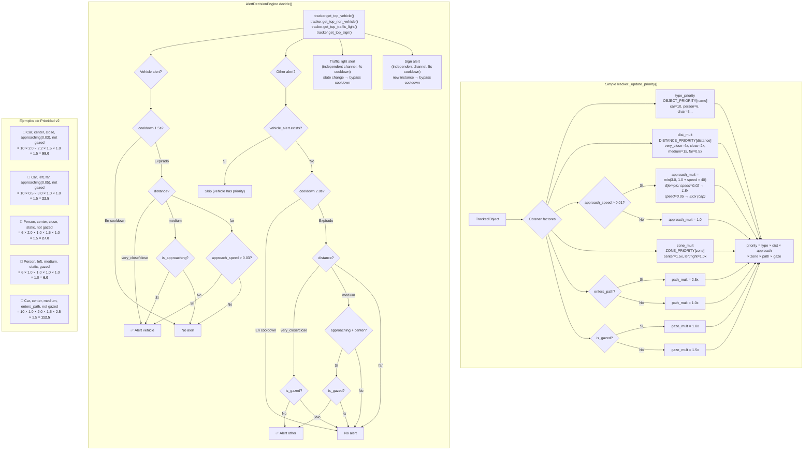

# DEVELOPER_DIARY.md — Bitácora de Diseño de Features

Registro detallado de cómo se pensó y construyó cada feature, aplicando el [Framework de las 5 Preguntas](PAIR_WORKFLOW.md#framework-las-5-preguntas).

Se llena **después** de completar cada feature. El objetivo es ver cómo pensaste, qué decidiste, y por qué — para que el patrón se vuelva natural.

---

## Feature: Pipeline MVP — Captura, Detección, Audio y Dashboard
**Fecha:** 2025-01 (commits iniciales)
**Branch:** `main`
**Estado:** Completada

---

### P1: Historia del Usuario
> "Yo camino por la calle con mis gafas Aria y necesito que el sistema detecte obstáculos en tiempo real, me diga qué hay y dónde está — con sonido diferenciado por posición y distancia. Quiero ver un dashboard en mi laptop para verificar que todo funciona."

### P2: Estados y Transiciones

```
[Sin frame] ──captura──▶ [Frame RGB] ──YOLO+Depth──▶ [Detecciones con distancia]
    ──zona L/C/R──▶ [Alerta audio] ──beep espacial──▶ [Usuario escucha]
                                    ──dashboard──▶ [Dev ve MJPEG + radar]
```

**¿Por qué estos estados?**
- El flujo es lineal: captura → proceso → output (audio + visual). No hay bifurcaciones complejas porque es un pipeline de streaming
- Separar audio y visual permite que el usuario (ciego) reciba feedback auditivo mientras el dev monitorea visualmente

**¿Qué descarté?**
- Gradio como dashboard (demasiado pesado, se reemplazó por Flask MJPEG)
- Procesamiento secuencial YOLO → Depth (se cambió a CUDA streams paralelos desde el inicio)

### P3: Veo / Necesito

| Estado | Lo que ve el usuario | Datos que necesito | De dónde vienen |
|---|---|---|---|
| Caminando | Escucha beeps posicionales | Frame RGB 720p | Observer (webcam/video/Aria) |
| Obstáculo detectado | Beep izq/centro/der + frecuencia por distancia | Bounding boxes + depth map | YOLO26s + Depth Anything V2 |
| Dev monitoreando | MJPEG stream + radar top-down + depth overlay | Frames anotados | Dashboard + Flask server |

### P4: Inventario

| Necesito | ¿Existe? | Decisión | Por qué |
|---|---|---|---|
| Captura de frames multi-source | No | Crear `BaseObserver` + `MockObserver` | Patrón abstracto para soportar webcam, video, Aria, RealSense sin cambiar pipeline |
| Detección de objetos | Sí (Ultralytics YOLO) | Reusar YOLO26s | Modelo rápido, FP16 nativo, bien integrado con OpenCV |
| Estimación de profundidad | Sí (Depth Anything V2) | Reusar modelo Small | Balance velocidad/precisión, funciona monocular |
| Audio espacial | No | Crear `AudioFeedback` | Beeps estéreo L/R con numpy+sounddevice, sin dependencias pesadas |
| Dashboard web | No | Crear Flask MJPEG | Más ligero que Gradio, sin WebSocket, funciona en cualquier browser |
| Filtro por entorno | No | Crear `CLASS_FILTERS` en types.py | indoor/outdoor/all — no necesitas detectar coches dentro de casa |

### P5: Diagrama de Pegamento

```
[Observer] ──frame RGB──▶ [ParallelDetector] ──detecciones──▶ [AudioFeedback]
                                │                                    │
                                ▼                                    ▼
                          [Dashboard] ──MJPEG──▶ [Flask :5000]   [Speakers]
```

**¿Por qué esta conexión?**
- Observer desacoplado del detector permite cambiar fuente sin tocar lógica
- Dashboard consume los mismos datos que audio — single source of truth
- Flask MJPEG es stateless, no necesita WebSocket ni frontend JS complejo

### Implementación

**Archivos creados:**
- `src/core/observer.py` — BaseObserver, MockObserver (webcam/video con NVDEC opcional)
- `src/core/detector.py` — ParallelDetector con YOLO + Depth en CUDA streams
- `src/core/audio.py` — AudioFeedback con beeps espaciales estéreo
- `src/core/dashboard.py` — Dashboard con radar 2D y depth overlay
- `src/core/types.py` — Detection dataclass, CLASS_FILTERS por modo
- `src/web/main.py` — Flask server con endpoints /video_feed, /depth_feed, /status
- `run.py` — Entry point con menú interactivo de fuentes

**Decisiones clave:**
- CUDA streams paralelos para YOLO + Depth desde el día 1 — no secuencial
- FP16 por defecto en Depth Anything V2 (mitad VRAM, ~mismo resultado)
- Beeps con panning estéreo L/R basado en zona del objeto (no solo volumen)
- Frecuencia 1000 Hz (crítico) vs 500 Hz (info) — distinguible sin mirar
- Flask MJPEG streaming en vez de Gradio — 0 dependencias frontend

### Reflexión
- **Lo que funcionó:** El patrón Observer abstracto pagó dividendos inmediatos — agregar RealSense y Aria después fue trivial
- **Lo que costó:** Calibrar los umbrales de distancia con depth relativo (no metros) requirió mucha iteración manual
- **Lo que haría diferente:** Definir umbrales en metros desde el inicio (se resolvió después con RealSense hardware depth)
- **Patrón reutilizable:** `BaseObserver` + factory por tipo de fuente. CUDA streams paralelos para modelos independientes

---

## Feature: Eye Gaze — Detección de Mirada con Meta Model
**Fecha:** 2025-01
**Branch:** `main`
**Estado:** Completada

---

### P1: Historia del Usuario
> "Yo camino y el sistema me avisa de una silla a mi izquierda, pero ya la estoy mirando — no necesito esa alerta. Solo avísame de lo que NO estoy viendo."

### P2: Estados y Transiciones

```
[Frame RGB + Eye Image] ──gaze model──▶ [Gaze Point (x,y)]
    ──check bbox──▶ [Objeto gazed=true] ──no alerta──▶ [Silencio]
                    [Objeto gazed=false] ──alerta──▶ [Beep/TTS]
```

**¿Por qué estos estados?**
- Binario gazed/not_gazed es suficiente — no necesitamos probabilidad continua de atención
- Reduce spam de alertas: si ya ves el objeto, no necesitas que te lo digan

**¿Qué descarté?**
- Probability-based gaze (0.0-1.0) — demasiado complejo para la decisión de alertar o no
- Simple pupil detection como único método — impreciso sin modelo entrenado

### P3: Veo / Necesito

| Estado | Lo que ve el usuario | Datos que necesito | De dónde vienen |
|---|---|---|---|
| Mirando al objeto | Silencio (no alerta) | Gaze point + bbox del objeto | Meta Eye Gaze model + YOLO |
| No mirando al objeto | Beep/TTS de alerta | is_gazed=false en Detection | Gaze check con tolerance 10% |
| Dev monitoreando | Overlay semi-transparente en objetos gazed | Gaze visualization | Dashboard (filled bbox verde) |

### P4: Inventario

| Necesito | ¿Existe? | Decisión | Por qué |
|---|---|---|---|
| Modelo de eye gaze | Sí (Meta projectaria_eyetracking) | Reusar | Modelo entrenado para Aria glasses, funciona con eye camera |
| Eye camera image | Sí (Aria SDK callbacks) | Reusar | Observer ya captura eye tracking frames |
| Gaze-to-bbox check | No | Crear `check_gaze_on_detection()` | Tolerance margin (10%) para compensar imprecisión |
| Visual feedback | No | Extender Dashboard | Filled semi-transparent bbox para objetos gazed |
| Fallback sin modelo | No | Crear `_estimate_gaze_simple()` | Simple pupil detection si Meta model no disponible |

### P5: Diagrama de Pegamento

```
[Observer] ──eye image──▶ [Gaze Model] ──(x,y) gaze point──▶ [check_gaze_on_detection]
                                                                       │
[YOLO] ──bboxes──▶ ─────────────────────────────────────────────────────┘
                                                                       │
                                                               [Detection.is_gazed]
                                                                       │
                                              ┌────────────────────────┤
                                              ▼                        ▼
                                     [AudioFeedback]           [Dashboard overlay]
```

**¿Por qué esta conexión?**
- Gaze como tercer CUDA stream paralelo a YOLO y Depth — no añade latencia
- `is_gazed` como campo booleano en Detection — simple de consumir por audio y dashboard
- Tolerance margin del 10% del frame compensa imprecisión del modelo

### Implementación

**Archivos modificados:**
- `src/core/detector.py` — `_load_gaze`, `estimate_gaze`, `check_gaze_on_detection`, `_estimate_gaze_meta`, `_estimate_gaze_simple`
- `src/core/dashboard.py` — `_draw_gaze`, overlay semi-transparente en `_draw_detections`
- `src/core/types.py` — Campo `is_gazed: bool` en Detection dataclass
- `src/web/main.py` — Integración gaze en loop de procesamiento

**Decisiones clave:**
- Gaze corre en CUDA stream paralelo #3 (junto a YOLO stream #1 y Depth stream #2)
- Booleano `is_gazed` en vez de float — decisión binaria más clara para el motor de alertas
- Filled semi-transparent bbox (verde) para objetos gazed — feedback visual sin ocluir detección
- Fallback a pupil detection simple si Meta model no carga

### Reflexión
- **Lo que funcionó:** Integrar gaze como stream paralelo — 0 ms adicionales de latencia en el pipeline
- **Lo que costó:** Obtener los pesos del modelo Meta (Git LFS issues, paths incorrectos, múltiples fixes)
- **Lo que haría diferente:** Verificar disponibilidad de pesos antes de integrar el modelo
- **Patrón reutilizable:** Campo booleano de estado en dataclass + CUDA stream paralelo para modelo adicional

---

## Feature: Tracking Temporal y Motor de Alertas
**Fecha:** 2025-02
**Branch:** `main`
**Estado:** Completada

---

### P1: Historia del Usuario
> "Yo camino y hay un coche acercándose desde la derecha. El sistema solo me dice 'coche, derecha' una vez — pero necesito que entienda que se está acercando y me avise con más urgencia. Y si ya estoy mirando a una persona cercana, no me repita esa alerta cada segundo."

### P2: Estados y Transiciones

```
[Detección nueva] ──IoU match──▶ [Track existente: actualizar history]
                   ──no match──▶ [Track nuevo: crear]

[Track con history] ──slope depth > 0──▶ [approaching=true] ──prioridad ×2──▶ [Alerta urgente]
                    ──bearing → center──▶ [enters_path=true] ──prioridad ×2.5──▶ [Alerta lateral]
                    ──stable──▶ [prioridad base] ──cooldown check──▶ [Alerta o silencio]
```

**¿Por qué estos estados?**
- Tracking temporal da contexto: un coche acercándose es más peligroso que uno estacionado
- IoU matching es simple y suficiente para first-person view (objetos se mueven poco entre frames)
- Cooldowns por tipo evitan spam sin perder alertas críticas

**¿Qué descarté?**
- Feature embedding matching (DeepSORT) — demasiado pesado para tiempo real, IoU es suficiente
- Alerta uniforme para todos los objetos — vehículos necesitan prioridad absoluta

### P3: Veo / Necesito

| Estado | Lo que ve el usuario | Datos que necesito | De dónde vienen |
|---|---|---|---|
| Objeto acercándose | Beep más frecuente / TTS urgente | depth_history + approach slope | Tracker (regresión lineal últimos 3 frames) |
| Objeto entrando en path | Alerta lateral ("car, right") | bearing_history + lateral_speed | Tracker (pixel_to_bearing con FOV) |
| Mismo objeto, ya alertado | Silencio (cooldown) | last_alert_time por objeto | AlertDecisionEngine |
| Vehículo cercano | Alerta inmediata (prioridad máxima) | object_type + distance | Tracker priority formula |

### P4: Inventario

| Necesito | ¿Existe? | Decisión | Por qué |
|---|---|---|---|
| Matching entre frames | No | Crear SimpleTracker con IoU | Simple, rápido, suficiente para FOV fijo |
| Historia de profundidad | No | Crear TrackedObject con depth_history | Deque de últimos 10 valores para regresión |
| Detección de acercamiento | No | Crear `_is_approaching()` | Regresión lineal en depth_history (slope > 0.01) |
| Bearing en radianes | No | Crear `_pixel_to_bearing()` | FOV-aware: consistente entre cámaras con diferente FOV |
| Motor de decisión | No | Crear AlertDecisionEngine | Separa decisión (¿alertar?) de ejecución (beep/TTS) |
| Prioridad dinámica | No | Crear fórmula multiplicativa | type × distance × approach × path × gaze — cada factor amplifica |

### P5: Diagrama de Pegamento

```
[ParallelDetector] ──detecciones──▶ [SimpleTracker.update()] ──tracks con prioridad──▶
    ──▶ [AlertDecisionEngine] ──vehicle_alert──▶ [AudioFeedback.play_vehicle()]
                               ──other_alert──▶ [AudioFeedback.play_alert()]
                               ──no alert──▶ [silencio]
```

**¿Por qué esta conexión?**
- Tracker acumula estado temporal, AlertEngine decide basado en ese estado
- Separación Tracker (estado) vs AlertEngine (decisión) = single responsibility
- Vehículos con canal separado — nunca bloqueados por cooldown de otros objetos

### Implementación

**Archivos creados:**
- `src/core/tracker.py` — SimpleTracker, TrackedObject, IoU matching, priority formula
- `src/core/alert_engine.py` — AlertDecisionEngine con cooldowns diferenciados

**Archivos modificados:**
- `src/core/detector.py` — Integración del tracker en el pipeline
- `src/web/main.py` — Uso de tracker + alert engine en el loop principal

**Decisiones clave:**
- Fórmula multiplicativa de prioridad: `type(10) × distance(4.0) × approach(2.0) × path(2.5) × gaze(1.5)` — score máximo teórico = 300
- Cooldowns: vehicle 1.5s, other 2.0s, same object 3.0s — anti-spam
- Vehículos alertan si `close OR (approaching AND medium)` — más agresivo
- Otros alertan solo si `close AND not_gazed` — menos intrusivo
- Bearing usa FOV real de la cámara para umbrales consistentes (webcam 66°, Aria 110°, RealSense 87°)

### Reflexión
- **Lo que funcionó:** IoU matching resultó sorprendentemente robusto para first-person view
- **Lo que costó:** Calibrar la fórmula de prioridad — muchas iteraciones con videos de prueba
- **Lo que haría diferente:** Empezar con bearing en radianes desde el inicio (se añadió después como `8b654ed`)
- **Patrón reutilizable:** Fórmula multiplicativa de prioridad donde cada factor es independiente y configurable

---

## Feature: Optimización GPU — TensorRT FP16 y CUDA Streams
**Fecha:** 2025-01
**Branch:** `main`
**Estado:** Completada

---

### P1: Historia del Usuario
> "Yo necesito que el pipeline completo corra a >30 FPS en mi RTX 2060 (6GB VRAM). Con PyTorch puro llego a ~34 FPS, pero con TensorRT debería poder duplicar el rendimiento."

### P2: Estados y Transiciones

```
[Modelo PyTorch FP16] ──export ONNX──▶ [ONNX graph] ──trtexec──▶ [TensorRT engine FP16]
    ──load──▶ [Inference buffer alloc] ──stream──▶ [Parallel execution on GPU]

[Startup] ──check engine──▶ [TRT existe: cargar] / [No existe: fallback PyTorch]
```

**¿Por qué estos estados?**
- TensorRT es GPU-específico y versión-específica — el engine se regenera si cambia hardware
- Fallback a PyTorch garantiza que siempre funciona aunque no haya engine

**¿Qué descarté?**
- INT8 quantization — requiere calibración dataset, FP16 ya da suficiente speedup
- torch.compile — inestable con algunos modelos, TensorRT es más predecible

### P3: Veo / Necesito

| Estado | Lo que ve el usuario | Datos que necesito | De dónde vienen |
|---|---|---|---|
| TRT disponible | Pipeline a ~67 FPS (14.99ms) | Engine files (.engine) | export_tensorrt.py |
| Sin TRT | Pipeline a ~34 FPS (PyTorch FP16) | Modelos PyTorch | HuggingFace / Ultralytics |
| Exportando | Script genera engine para GPU actual | ONNX intermedio | PyTorch → ONNX → TensorRT |

### P4: Inventario

| Necesito | ¿Existe? | Decisión | Por qué |
|---|---|---|---|
| Export pipeline ONNX→TRT | No | Crear `export_tensorrt.py` | Pipeline unificado para los 3 modelos (YOLO, Depth, Gaze) |
| TensorRT runtime | Sí (tensorrt python) | Reusar | API estándar: allocate buffers, copy, execute, copy back |
| CUDA streams paralelos | Ya existe en detector.py | Extender | Añadir gaze como stream #3 |
| Fallback automático | No | Crear lógica try/except en detector | Intenta TRT, si falla carga PyTorch FP16 |
| Depth export especial | No | Crear `export_depth_tensorrt.py` | HuggingFace model necesita wrapper para ONNX limpio |

### P5: Diagrama de Pegamento

```
[export_tensorrt.py] ──genera──▶ [models/*.engine]
                                       │
[detector.py startup] ──busca engine──▶ ¿existe?
    ──sí──▶ [TensorRT inference path]  ──stream 1──▶ YOLO
                                        ──stream 2──▶ Depth
                                        ──stream 3──▶ Gaze
    ──no──▶ [PyTorch FP16 fallback]
```

**¿Por qué esta conexión?**
- Export offline (una vez) → inference runtime (siempre) — no exportar en cada startup
- Fallback transparente — mismo API para TRT y PyTorch en detector.py
- 3 CUDA streams = máximo paralelismo sin contención

### Implementación

**Archivos creados:**
- `scripts/export_tensorrt.py` — Pipeline unificado YOLO + Depth + Gaze export
- `scripts/export_depth_tensorrt.py` — Export especializado para Depth Anything V2

**Archivos modificados:**
- `src/core/detector.py` — `_load_depth_tensorrt`, `_run_depth_tensorrt`, buffer allocation, stream #3 para gaze
- `src/web/main.py` — TensorRT re-enabled tras fixes de conflictos CUDA

**Decisiones clave:**
- FP16 como target (no INT8) — buen balance speedup vs precisión sin calibración
- `depth_interval=3` — depth cada 3 frames para mantener >60 FPS
- OpenCV CUDA para preprocesamiento (resize, cvtColor) — evita transfer CPU↔GPU
- Engine files son GPU-específicos — README documenta que hay que regenerar si cambia hardware
- YOLO usa export nativo de Ultralytics, Depth y Gaze usan pipeline custom ONNX→TRT

**Benchmarks (RTX 2060, 6GB VRAM):**
- YOLO: 5.3ms (188 FPS) — speedup 1.96x vs PyTorch
- Depth: 7.9ms (127 FPS) — speedup 1.77x vs PyTorch
- Pipeline completo: 14.99ms (66.7 FPS)
- Peak VRAM: 1,236 MB allocated

### Reflexión
- **Lo que funcionó:** Speedup de ~2x en cada modelo con cambio mínimo de código
- **Lo que costó:** Debugging de buffer shapes y memory alignment para TensorRT custom (Depth)
- **Lo que haría diferente:** Usar `trtexec` CLI para validación rápida antes de integrar en Python
- **Patrón reutilizable:** Try TRT → fallback PyTorch. Export ONNX → TRT como script offline separado

---

## Feature: TTS con NeMo — Proceso CUDA Aislado y Pre-caching
**Fecha:** 2025-01
**Branch:** `main`
**Estado:** Completada

---

### P1: Historia del Usuario
> "Yo escucho los beeps pero no siempre entiendo qué objeto es. Necesito que el sistema me diga con voz 'persona, izquierda' o 'coche, derecha' — sin que la generación de voz ralentice la detección."

### P2: Estados y Transiciones

```
[Alerta generada] ──mensaje──▶ [TTS Queue]
    ──cached?──▶ [Reproducir WAV instantáneo (<10ms)]
    ──nuevo?──▶ [FastPitch → mel] ──▶ [HiFi-GAN → wav] ──▶ [Reproducir (~200ms)]

[Startup] ──load models (~90s)──▶ [Pre-cache 27 frases] ──▶ [Listo]
```

**¿Por qué estos estados?**
- TTS neural es lento (~200ms por frase) pero suena mucho mejor que pyttsx3
- Pre-cache de frases comunes elimina latencia en el 90% de los casos
- Proceso separado evita que TTS bloquee detección

**¿Qué descarté?**
- pyttsx3 como TTS principal — voz robótica, poco natural
- TTS en el mismo proceso — conflictos CUDA con detector

### P3: Veo / Necesito

| Estado | Lo que ve el usuario | Datos que necesito | De dónde vienen |
|---|---|---|---|
| Frase cacheada | Voz instantánea | WAV pre-generado | PRECACHE_PHRASES dict (27 frases) |
| Frase nueva | Voz con ~200ms delay | Texto a sintetizar | AlertDecisionEngine |
| Queue llena | Solo la más reciente | Drain de queue | TTSProcess._tts_worker |
| Startup | 90s de silencio | Modelos NeMo | HuggingFace (FastPitch + HiFi-GAN) |

### P4: Inventario

| Necesito | ¿Existe? | Decisión | Por qué |
|---|---|---|---|
| TTS neural de calidad | Sí (NVIDIA NeMo) | Reusar FastPitch + HiFi-GAN | Calidad alta, GPU-acelerado, modelos pre-entrenados |
| Proceso aislado CUDA | No | Crear TTSProcess con mp.spawn | Evita conflictos CUDA con detector + Aria SDK |
| Pre-caching | No | Crear PRECACHE_PHRASES | 27 combinaciones objeto×dirección pre-generadas al startup |
| Fallback sin GPU TTS | Sí (pyttsx3) | Reusar como fallback | Si NeMo no carga, pyttsx3 funciona en CPU |
| AMP FP16 para TTS | Sí (torch.cuda.amp) | Reusar | NeMo no soporta .half() directamente, AMP es el camino |

### P5: Diagrama de Pegamento

```
[AlertDecisionEngine] ──texto──▶ [mp.Queue] ──▶ [TTSProcess (CUDA separado)]
                                                        │
                                                  ¿en cache?
                                                  │         │
                                                  sí        no
                                                  │         │
                                              [WAV cache]  [FastPitch→HiFi-GAN]
                                                  │         │
                                                  └────┬────┘
                                                       ▼
                                                [sounddevice.play()]
```

**¿Por qué esta conexión?**
- Queue desacopla producción (alertas) de consumo (TTS) — si TTS tarda, no bloquea detector
- Drain queue + solo más reciente = anti-acumulación de mensajes obsoletos
- Proceso spawn (no fork) evita heredar contexto CUDA del main

### Implementación

**Archivos creados:**
- `src/core/tts_process.py` — TTSProcess, `_tts_worker`, PRECACHE_PHRASES, AMP FP16

**Archivos modificados:**
- `src/core/audio.py` — Integración con NeMo process, fallback a pyttsx3
- `run.py` — `CUDA_VISIBLE_DEVICES=""` antes de imports, eliminación de `LD_PRELOAD`

**Decisiones clave:**
- `mp.get_context('spawn')` — fork heredaría contexto CUDA del main = crash
- 27 frases pre-cacheadas: 9 objetos (person, car, bike...) × 3 direcciones (left, right, straight)
- "straight" en vez de "ahead" — menos sílabas = TTS más rápido
- Worker drena queue y solo procesa el más reciente — anti-backlog
- AMP FP16 en vez de `.half()` — NeMo requiere autocast context, no manual cast
- `os.environ.pop("LD_PRELOAD")` en worker — jemalloc solo para main (Aria SDK)

### Reflexión
- **Lo que funcionó:** Pre-caching eliminó latencia perceptible en el 90%+ de las alertas
- **Lo que costó:** 90s de startup por descarga de modelos NeMo (~1.5 GB)
- **Lo que haría diferente:** Guardar modelos en volumen Docker para no re-descargar
- **Patrón reutilizable:** Proceso CUDA aislado con spawn + queue + cache para cualquier modelo GPU

---

## Feature: Meta Aria Glasses — Conexión Real y Patrón de Aislamiento
**Fecha:** 2025-02
**Branch:** `main`
**Estado:** Completada

---

### P1: Historia del Usuario
> "Yo conecto mis gafas Meta Aria por USB, inicio el sistema, y recibo detecciones en tiempo real con eye tracking nativo. Si Aria SDK corrompe memoria o CUDA crashea, los procesos están aislados y el sistema no muere entero."

### P2: Estados y Transiciones

```
[Gafas conectadas USB] ──pair──▶ [Aria SDK streaming]
    ──RGB callback──▶ [Queue] ──▶ [Main process]
    ──Eye callback──▶ [Queue] ──▶ [Gaze model]

[Main (NO CUDA)] ──frame──▶ [DetectorProcess (CUDA spawn)]
                  ──alert──▶ [TTSProcess (CUDA spawn)]

[FastDDS issue] ──jemalloc LD_PRELOAD──▶ [Heap estable]
                ──pero CUDA child──▶ [pop LD_PRELOAD en worker]
```

**¿Por qué estos estados?**
- Aria SDK usa FastDDS (middleware DDS) que corrompe heap con glibc >= 2.39
- CUDA no puede compartir contexto entre procesos (fork hereda, spawn no)
- Solución: 3 procesos aislados, cada uno con su propio entorno

**¿Qué descarté?**
- Todo en un proceso — crash de FastDDS mata CUDA
- Fork en vez de spawn — hereda contexto CUDA corrompido
- Aria SDK en proceso separado (AriaProcess) — funciona pero añade latencia por serialización extra

### P3: Veo / Necesito

| Estado | Lo que ve el usuario | Datos que necesito | De dónde vienen |
|---|---|---|---|
| Aria conectada | Stream RGB 1408×1408 + eye tracking | USB device + pair token | Aria SDK 2.2.0 |
| Procesando | Detecciones con gaze nativo | Frames en queue | AriaDemoObserver callbacks |
| FastDDS crash | (prevenido) Sistema estable | jemalloc preloaded | docker-compose.yml LD_PRELOAD |
| Sin Aria hardware | Testing con datasets VRS | VRS file + gaze CSV | AriaDatasetObserver |

### P4: Inventario

| Necesito | ¿Existe? | Decisión | Por qué |
|---|---|---|---|
| Aria SDK streaming | Sí (projectaria_tools) | Reusar | API oficial para RGB, eye, SLAM, IMU |
| Aislamiento CUDA | No | Crear patrón 3-procesos | Main (no CUDA) + Detector (CUDA) + TTS (CUDA) |
| Workaround FastDDS | No | Crear jemalloc LD_PRELOAD | Heap corruption con glibc malloc, jemalloc lo evita |
| Testing sin hardware | No | Crear AriaDatasetObserver | Reproduce VRS + CSV de gaze sincronizado |
| DDS subscription timing | No | Crear defer subscription | `auto_subscribe=False` hasta que detector esté listo |
| CUDA hide en main | No | Crear setup en run.py | `CUDA_VISIBLE_DEVICES=""` ANTES de cualquier import |

### P5: Diagrama de Pegamento

```
[run.py: CUDA_VISIBLE_DEVICES=""] ──import──▶ [Main Process (NO CUDA)]
    │                                              │
    │                                    [AriaDemoObserver]──USB──▶[Aria Glasses]
    │                                              │
    │                              ┌───frame via SHM/Queue───┐
    │                              ▼                         │
    │                     [DetectorProcess]              [TTSProcess]
    │                     (spawn, CUDA restored)        (spawn, CUDA restored)
    │                     (pop LD_PRELOAD)              (pop LD_PRELOAD)
    │                              │
    └──────────────────────────────┘
              docker-compose.yml: LD_PRELOAD=jemalloc, shm_size=256m
```

**¿Por qué esta conexión?**
- Main process sin CUDA = Aria SDK (FastDDS) no interfiere con GPU
- Workers restauran CUDA con `os.environ.pop("CUDA_VISIBLE_DEVICES")` + quitan jemalloc
- shm_size=256m para shared memory IPC + FastDDS internal buffers
- DDS subscription diferida: evita flood de "sample lost" al inicio

### Implementación

**Archivos creados:**
- `src/core/aria_process.py` — AriaProcess alternativa (Aria SDK en proceso separado)

**Archivos modificados:**
- `src/core/observer.py` — AriaDemoObserver (USB+WiFi), AriaDatasetObserver (VRS+CSV)
- `src/core/detector_process.py` — DetectorProcess con spawn, CUDA restore, LD_PRELOAD cleanup
- `run.py` — CUDA hide, jemalloc removal, spawn setup, NUMBA_DISABLE_CUDA
- `docker/docker-compose.yml` — LD_PRELOAD jemalloc, shm_size, privileged, host network
- `scripts/test_aria_streaming.py` — Diagnóstico de conexión Aria
- `scripts/test_aria_streaming.sh` — Test múltiples configuraciones de allocator

**Decisiones clave:**
- **Patrón 3 procesos aislados**: La decisión arquitectónica más importante del proyecto
- `CUDA_VISIBLE_DEVICES=""` en run.py ANTES de cualquier import torch
- Workers usan `os.environ.pop()` para restaurar CUDA en child process
- jemalloc solo en main (para FastDDS), eliminado en workers CUDA
- `auto_subscribe=False` + subscribe después de detector ready — evita perder samples
- Docker: `privileged: true` + `network_mode: host` requeridos por Aria SDK

### Reflexión
- **Lo que funcionó:** El patrón de 3 procesos aislados resolvió TODOS los conflictos CUDA/FastDDS de una vez
- **Lo que costó:** Semanas de debugging: heap corruption, CUDA context inheritance, DDS timeouts, jemalloc interactions
- **Lo que haría diferente:** Empezar con multiprocessing spawn desde el día 1 — el refactor fue doloroso
- **Patrón reutilizable:** Main sin GPU + workers spawn con CUDA restored. `LD_PRELOAD` selectivo por proceso

---

## Feature: Docker Multi-Stage, NVDEC y Soporte Blackwell
**Fecha:** 2025-01 a 2025-02
**Branch:** `main`
**Estado:** Completada

---

### P1: Historia del Usuario
> "Yo quiero levantar el sistema con un solo comando (`docker compose up`), sin instalar CUDA, OpenCV, TensorRT ni NeMo en mi host. Y si cambio código Python, que no tarde 20 minutos en rebuild."

### P2: Estados y Transiciones

```
[Sin Docker] ──build base (~20min, 1 vez)──▶ [aria-base:opencv-nvdec]
    ──build app (~3min)──▶ [aria-guard:tensorrt]
    ──compose up──▶ [Sistema corriendo]

[Cambio código] ──dev mode (volume mount)──▶ [Reload sin rebuild]
[Cambio dependencia] ──rebuild app (~3min)──▶ [Nueva imagen app]
[Cambio OpenCV] ──rebuild base+app (~25min)──▶ [Nueva imagen completa]
```

**¿Por qué estos estados?**
- OpenCV con CUDA tarda ~20 min en compilar — solo se hace una vez
- Separar base/app permite iteración rápida (3 min) para cambios de dependencias
- Dev mode con volumes = 0 rebuild para cambios de código

**¿Qué descarté?**
- Dockerfile monolítico (Dockerfile.tensorrt legacy) — 20 min por cada cambio
- Build sin auto-detección de GPU — compilar para todas las archs = binario enorme y lento

### P3: Veo / Necesito

| Estado | Lo que ve el usuario | Datos que necesito | De dónde vienen |
|---|---|---|---|
| Primera vez | Build base 20 min | CUDA arch de la GPU | nvidia-smi auto-detect |
| Rebuild app | 3 min | Dependencias Python | Dockerfile.app |
| Dev mode | 0 rebuild | Código montado RO | docker-compose.yml volumes |
| Video NVDEC | Decodificación GPU (0 CPU) | Video Codec SDK 13.0 | Dockerfile.base (stub libs) |
| RTX 50xx | Soporte Blackwell | CUDA 12.8.1 | Base image nvidia/cuda |

### P4: Inventario

| Necesito | ¿Existe? | Decisión | Por qué |
|---|---|---|---|
| OpenCV con CUDA + NVDEC | No (pip install no tiene CUDA) | Crear Dockerfile.base | Compilar from source con flags específicos |
| Build rápido para app | No | Crear Dockerfile.app sobre base | Separar lo que cambia poco (OpenCV) de lo que cambia mucho (deps Python) |
| Auto-detect GPU arch | No | Crear docker-build.sh | nvidia-smi → parse arch → CUDA_ARCH_BIN |
| NVDEC en container | No | Crear stub libs + SDK headers | Video Codec SDK 13.0 headers + libnvcuvid.so stub |
| Dev mode | No | Crear volume mounts en compose | src/:ro, run.py:ro, scripts/:ro |
| Validación pre-build | No | Crear validate-docker.sh | Ahorra 20 min de build fallido |

### P5: Diagrama de Pegamento

```
[docker-build.sh] ──auto-detect GPU──▶ [CUDA_ARCH_BIN]
    ──▶ [Dockerfile.base] ──OpenCV+NVDEC──▶ [aria-base:opencv-nvdec]
    ──▶ [Dockerfile.app] ──PyTorch+TRT+NeMo──▶ [aria-guard:tensorrt]

[docker-compose.yml] ──volumes──▶ {src/, models/, data/, audio, USB}
                      ──env──▶ {NVIDIA_CAPABILITIES, LD_PRELOAD, shm_size}
                      ──devices──▶ {/dev/video0, /dev/snd, /dev/bus/usb}
```

**¿Por qué esta conexión?**
- Multi-stage build: builder compila OpenCV, runtime solo copia binarios = imagen más ligera
- Auto-detect compila solo para la GPU del host = binario más pequeño y rápido
- compose centraliza TODA la configuración runtime — nunca `docker run` manual

### Implementación

**Archivos creados:**
- `docker/Dockerfile.base` — Multi-stage: builder (OpenCV 4.13.0 + CUDA + NVDEC) → runtime
- `docker/Dockerfile.app` — App layer sobre base (PyTorch, TRT, NeMo, Aria SDK)
- `docker/docker-compose.yml` — Orquestación con GPU, volumes, audio, USB, jemalloc
- `docker/docker-build.sh` — Helper con auto-detect GPU y comandos base/app/all/run/dev
- `scripts/validate-docker.sh` — Pre-validación de Dockerfiles

**Archivos modificados:**
- `src/core/observer.py` — NVDEC support via `cv2.cudacodec.createVideoReader`

**Decisiones clave:**
- Base image `nvidia/cuda:12.8.1-cudnn-devel` (builder) → `runtime` (final) = ahorra ~5 GB
- CUDA_ARCH_BIN auto-detectado: solo compila para GPU actual (RTX 2060=7.5, 50xx=12.0)
- Video Codec SDK 13.0 con stub libs para NVDEC en builder (real driver en runtime)
- `NVIDIA_DRIVER_CAPABILITIES=compute,utility,video` — el `video` es clave para NVDEC
- Dev mode: volumes RO para código — cambios instant sin rebuild
- `shm_size: 256m` — shared memory para multiprocessing + FastDDS

### Reflexión
- **Lo que funcionó:** Separar base/app fue game-changer — de 20 min a 3 min por iteración
- **Lo que costó:** NVDEC fue un infierno — stub libs, SDK versions, codec headers, múltiples intentos
- **Lo que haría diferente:** Usar validate-docker.sh desde el primer Dockerfile, no después de 5 builds fallidos
- **Patrón reutilizable:** Multi-stage Docker con auto-detect GPU. Separar lo estable (compilación) de lo volátil (deps)

---

## Feature: RealSense D435 — Depth Hardware y Shared Memory Zero-Copy
**Fecha:** 2025-02
**Branch:** `main`
**Estado:** Completada

---

### P1: Historia del Usuario
> "Yo conecto la Intel RealSense D435 y obtengo distancias reales en metros — no estimaciones relativas de un modelo monocular. El depth llega al detector sin copiar memoria, y si tengo RealSense, no gasto VRAM en Depth Anything V2."

### P2: Estados y Transiciones

```
[RealSense conectada] ──pipeline.start──▶ [RGB + Depth (mm) streams]
    ──align──▶ [Depth alineado a RGB] ──SHM──▶ [DetectorProcess]

[DetectorProcess] ──has_hardware_depth?──▶
    ──sí──▶ [Usar depth raw mm] ──mediana en bbox──▶ [Distancia real]
    ──no──▶ [Depth Anything V2] ──valor relativo──▶ [Distancia estimada]
```

**¿Por qué estos estados?**
- RealSense da depth en milímetros (stereo IR) — mucho más preciso que monocular
- Shared memory elimina serialización de Queue (~0 copy vs ~5ms por frame)
- Si hay hardware depth, Depth Anything V2 no se carga = 0.8 GB VRAM ahorrados

**¿Qué descarté?**
- Queue para frames grandes (720p RGB = ~2.7 MB por frame) — serialización demasiado lenta
- Media en vez de mediana para depth en bbox — outliers de RealSense (pixels=0) la distorsionan

### P3: Veo / Necesito

| Estado | Lo que ve el usuario | Datos que necesito | De dónde vienen |
|---|---|---|---|
| RealSense depth | Distancia real: <0.8m, <2m, <4m, >4m | depth_frame en mm (uint16) | RealSense pipeline + align |
| Shared memory | Transfer zero-copy entre procesos | Named SHM buffers | multiprocessing.shared_memory |
| Sin RealSense | Depth estimado (relativo) | Depth Anything V2 output | Modelo neural monocular |

### P4: Inventario

| Necesito | ¿Existe? | Decisión | Por qué |
|---|---|---|---|
| Depth hardware en mm | Sí (pyrealsense2) | Reusar | API nativa, depth stereo IR preciso |
| Alineación RGB-depth | Sí (rs.align) | Reusar | Correspondencia pixel-perfecta automática |
| Zero-copy IPC | No | Crear shared memory buffers | Queue serializa ~5ms/frame, SHM es ~0ms |
| Clasificación por metros | No | Crear `_depth_mm_to_distance()` | Umbrales absolutos: 0.8m/2m/4m |
| Detección de hardware depth | No | Crear flag `has_hardware_depth` | Desactiva modelo IA si hardware disponible |

### P5: Diagrama de Pegamento

```
[RealSenseObserver] ──RGB──▶ [SHM: aria_frame]     ──▶ [DetectorProcess]
                    ──depth mm──▶ [SHM: aria_hw_depth] ──▶ [detector: _depth_mm_to_distance]
                                                                │
                    [DetectorProcess] ──detections──▶ [SHM: result] ──▶ [Main]
                                      ──depth visual──▶ [SHM: aria_depth] ──▶ [Dashboard]

Sync: [frame_ready_event] ←→ [result_ready_event] (mp.Event)
```

**¿Por qué esta conexión?**
- Triple SHM: frame input + depth output + hardware depth input — cada buffer con tamaño apropiado
- Events para sincronización non-blocking — productor señaliza, consumidor espera
- Hardware depth desactiva Depth Anything V2 en detector = ahorra VRAM

### Implementación

**Archivos creados:**
- (ninguno nuevo — se extendieron los existentes)

**Archivos modificados:**
- `src/core/observer.py` — RealSenseObserver: pipeline, align, depth raw mm, FOV 87°
- `src/core/detector_process.py` — Shared memory buffers (SHM_FRAME, SHM_DEPTH, SHM_HW_DEPTH), Events
- `src/core/detector.py` — `_get_depth_in_bbox_raw`, `_depth_mm_to_distance`, hardware_depth path
- `src/web/main.py` — `has_hardware_depth` flag, depth visual from observer

**Decisiones clave:**
- Mediana (no media) para depth en bbox — robusta ante pixels sin lectura (valor 0 en RealSense)
- Umbrales absolutos en metros: very_close <0.8m, close <2m, medium <4m, far >4m
- SHM dimensionado dinámicamente según resolución del frame
- `has_hardware_depth=True` salta Depth Anything V2 completamente — ~0.8 GB VRAM libre
- Event-based sync en vez de polling — eficiente en CPU

### Reflexión
- **Lo que funcionó:** Shared memory redujo latencia IPC de ~5ms a ~0ms — medible en benchmarks
- **Lo que costó:** `memoryview` structure mismatch entre procesos (fix en `e0d8dbd`) — debugging opaco
- **Lo que haría diferente:** Empezar con shared memory desde el inicio, no migrar desde Queue después
- **Patrón reutilizable:** Named SHM + Events para IPC zero-copy entre procesos Python

---

## Feature: Jetson Orin Nano — ARM64, RealSense y TensorRT
**Fecha:** 2025-02
**Branch:** `main`
**Estado:** Completada

---

### P1: Historia del Usuario
> "Yo quiero correr aria-guard en un Jetson Orin Nano (ARM64) portátil, con RealSense D435 como sensor principal. Sin Aria SDK (no hay soporte ARM), pero con YOLO + Depth en TensorRT."

### P2: Estados y Transiciones

```
[Jetson Orin Nano] ──docker build──▶ [dustynv base + deps]
    ──RealSense──▶ [RGB + Depth hardware]
    ──ONNX──▶ [TensorRT engine (ARM64)]
    ──single process──▶ [Detección + alertas]
```

**¿Por qué estos estados?**
- Jetson no soporta Aria SDK — simplifica a single-process sin aislamiento CUDA
- dustynv imagen pre-compilada con PyTorch ARM64 — evita compilar from source
- ONNX es portable entre x86 y ARM64, pero engine TRT se genera en el target

**¿Qué descarté?**
- Aria SDK en Jetson — no existe para ARM64
- Compilar PyTorch from source — dustynv ya lo tiene
- Multiprocessing — innecesario sin Aria SDK (no hay conflicto FastDDS)

### P3: Veo / Necesito

| Estado | Lo que ve el usuario | Datos que necesito | De dónde vienen |
|---|---|---|---|
| Jetson deployment | Sistema portátil con batería | Jetson Orin Nano + RealSense | Hardware |
| TensorRT ARM64 | Inference optimizada | Engine generado en Jetson | ONNX → TRT en device |
| Sin Aria | Solo RealSense o webcam | Fuentes locales | Observer (MockObserver o RealSense) |

### P4: Inventario

| Necesito | ¿Existe? | Decisión | Por qué |
|---|---|---|---|
| Base Docker ARM64 | Sí (dustynv) | Reusar | PyTorch + TensorRT pre-compilados para Jetson |
| RealSense ARM64 | Sí (librealsense) | Reusar | Compilable en ARM64 con CUDA |
| TensorRT en ARM64 | Sí (JetPack 6.x) | Reusar | Incluido en JetPack, ONNX portable |
| OpenCV NumPy fix | No | Crear workaround | OpenCV 4.10.0 ARM64 tiene bug con NumPy 2.x |
| VRAM monitoring | No | Crear script | Orin Nano tiene 8 GB compartidos CPU/GPU |

### P5: Diagrama de Pegamento

```
[Jetson Orin Nano]
    │
    ├──▶ [Dockerfile.jetson] ──dustynv base──▶ [RealSense + PyTorch + TRT]
    │
    ├──▶ [docker-compose.jetson.yml] ──simplified──▶ [Single container]
    │
    └──▶ [RealSenseObserver] ──RGB+Depth──▶ [ParallelDetector (TRT)]
                                                      │
                                              [Tracker + AlertEngine + Audio]
```

**¿Por qué esta conexión?**
- Arquitectura simplificada vs x86: single process, sin Aria SDK, sin jemalloc
- RealSense como sensor principal — hardware depth elimina necesidad de modelo Depth Anything
- VRAM compartida CPU/GPU en Jetson — monitoreo crítico para evitar OOM

### Implementación

**Archivos creados:**
- `docker/Dockerfile.jetson` — ARM64 build con dustynv base, RealSense
- `docker/docker-compose.jetson.yml` — Compose simplificado para Jetson
- `docs/JETSON.md` — Documentación de deployment

**Archivos modificados:**
- `scripts/export_tensorrt.py` — ONNX portable para generar TRT en Jetson
- `docker/docker-build.sh` — Soporte para target jetson

**Decisiones clave:**
- dustynv como base image — ahorra horas de compilación de PyTorch en ARM64
- Single process — sin Aria SDK no hay conflicto FastDDS, no necesita aislamiento
- ONNX como formato intermedio portable — el engine TRT se genera en el Jetson target
- OpenCV 4.10.0 fix: numpy version pin para evitar incompatibilidad ARM64
- BNO086 IMU en compose (9-DOF) para orientación del usuario

### Reflexión
- **Lo que funcionó:** dustynv image ahorró días de setup — PyTorch ARM64 es pesado de compilar
- **Lo que costó:** Incompatibilidades NumPy/OpenCV en ARM64 — errores crípticos
- **Lo que haría diferente:** Probar en Jetson cada milestone, no acumular y portar al final
- **Patrón reutilizable:** ONNX como formato portable + TRT engine generado en target. dustynv para Jetson

---

## Feature: Gaze TensorRT y YOLO Fine-tuned para Navegación
**Fecha:** 2025-02
**Branch:** `main`
**Estado:** Completada

---

### P1: Historia del Usuario
> "Yo necesito que el modelo de gaze corra con TensorRT (como YOLO y Depth) y que YOLO detecte clases específicas de navegación — puertas, escaleras, bordillos — que COCO no tiene."

### P2: Estados y Transiciones

```
[Meta Eye Gaze .pth] ──wrapper──▶ [ONNX clean] ──trtexec──▶ [gaze.engine]
    ──load──▶ [TRT inference] ──fallback──▶ [PyTorch si falla]

[YOLO26s COCO] ──fine-tune 24 clases──▶ [yolo26s_nav.engine]
    ──load──▶ [Detección de puertas, escaleras, bordillos, etc.]
```

**¿Por qué estos estados?**
- Gaze en TensorRT completa los 3 modelos optimizados — pipeline uniforme
- YOLO fine-tuned con clases de navegación: COCO no tiene door, stairs, curb, etc.
- Fallback PyTorch para gaze si engine no existe — mismo patrón que los otros modelos

**¿Qué descarté?**
- Export directo del modelo Meta a ONNX — SplitAndConcat en dim=0 es problemático, necesita wrapper
- INT8 para gaze — el modelo es pequeño, FP16 es suficiente

### P3: Veo / Necesito

| Estado | Lo que ve el usuario | Datos que necesito | De dónde vienen |
|---|---|---|---|
| Gaze TRT | Gaze point más rápido | gaze.engine FP16 | export_tensorrt.py (gaze) |
| YOLO nav | Detección de 24 clases nav | yolo26s_nav.engine | Fine-tuning custom dataset |
| Fallback | Gaze PyTorch si no hay engine | Modelo .pth | projectaria_eyetracking |

### P4: Inventario

| Necesito | ¿Existe? | Decisión | Por qué |
|---|---|---|---|
| Gaze ONNX export | No (modelo tiene ops raras) | Crear GazeModelWrapper | Wrapper limpia SplitAndConcat para export ONNX |
| Pipeline ONNX→TRT | Sí (de export_depth) | Reusar `_onnx_to_tensorrt()` | Misma función para depth y gaze — DRY |
| Preprocesamiento gaze TRT | No | Crear `_preprocess_gaze()` | Replicar manualmente: normalize, split ojos, flip, resize |
| YOLO 24 clases nav | No | Crear fine-tune | COCO no tiene doors, stairs, curbs — clases críticas |
| TRT inference gaze | No | Crear `_estimate_gaze_tensorrt()` | Patrón similar a depth TRT |

### P5: Diagrama de Pegamento

```
[export_tensorrt.py]
    ├──gaze──▶ [GazeModelWrapper] ──ONNX──▶ [_onnx_to_tensorrt] ──▶ [gaze.engine]
    └──yolo──▶ [Ultralytics export] ──▶ [yolo26s_nav.engine]

[detector.py startup]
    ├──▶ [_load_gaze_tensorrt()] ──o──▶ [_load_gaze_pytorch()] fallback
    └──▶ [_load_yolo()] ──nav engine si existe──▶ [24 clases custom]
```

**¿Por qué esta conexión?**
- Pipeline de export reusable (`_onnx_to_tensorrt`) compartido entre depth y gaze
- GazeModelWrapper necesario porque el modelo original tiene operaciones incompatibles con ONNX estático
- YOLO nav como engine adicional — se puede alternar entre COCO (80 clases) y nav (24 clases)

### Implementación

**Archivos modificados:**
- `scripts/export_tensorrt.py` — GazeModelWrapper, `_load_gaze_pytorch`, `_gaze_to_onnx`, pipeline reusable
- `src/core/detector.py` — `_load_gaze_tensorrt`, `_estimate_gaze_tensorrt`, `_preprocess_gaze`

**Archivos trackeados:**
- `models/gaze.engine` — TensorRT engine para Meta Eye Gaze
- `models/yolo26s_nav.engine` — YOLO fine-tuned 24 clases navegación

**Decisiones clave:**
- GazeModelWrapper envuelve el modelo Meta para export ONNX limpio — sin SplitAndConcat problemático
- `_onnx_to_tensorrt()` compartida con depth — DRY, misma configuración (FP16, workspace 1GB)
- Preprocesamiento de gaze replicado manualmente para TRT (normalize → split ojos → flip derecho → resize 240×320)
- 24 clases de navegación: door, stairs, curb, crosswalk, traffic_light, fire_hydrant, etc.
- Fallback PyTorch automático si engine no existe

### Reflexión
- **Lo que funcionó:** Pipeline de export reusable — agregar gaze fue trivial después de tener depth
- **Lo que costó:** El wrapper para ONNX export — entender las operaciones internas del modelo Meta
- **Lo que haría diferente:** Documentar las limitaciones de export ONNX de cada modelo antes de intentar
- **Patrón reutilizable:** Wrapper model para limpiar ops incompatibles con ONNX. Pipeline `_onnx_to_tensorrt()` reusable

---

## Feature: Traffic Light Classification — Estado del Semáforo por HSV
**Fecha:** 2026-02-24
**Branch:** `main`
**Estado:** Completada

---

### P1: Historia del Usuario
> "Yo llego a un cruce y hay un semáforo. El sistema ya lo detecta como 'traffic light', pero no me dice si está en rojo o verde. Necesito saber si puedo cruzar o debo esperar."

### P2: Estados y Transiciones

```
[YOLO detecta "traffic light"] ──crop bbox──▶ [HSV analysis]
    ──top third red──▶ [state="red"] ──TTS──▶ "red light"
    ──mid third yellow──▶ [state="yellow"] ──TTS──▶ "yellow light"
    ──bottom third green──▶ [state="green"] ──TTS──▶ "green light"
    ──no match (>5%)──▶ [state=None] ──silencio──▶ (no alert)

[state cambia] ──cooldown bypass──▶ [Alerta inmediata]
[state igual] ──cooldown 4s──▶ [Esperar]
```

**¿Por qué estos estados?**
- El semáforo tiene 3 estados mutuamente excluyentes — solo uno está encendido
- El cambio de estado (rojo→verde) es la información más crítica — bypass cooldown
- Si no hay match claro (oclusión, glare), mejor no decir nada que decir mal

**¿Qué descarté?**
- Modelo clasificador (ResNet/MobileNet) — overhead de VRAM y latencia innecesario, HSV es suficiente para LEDs brillantes
- Clasificar todo el crop sin dividir en tercios — confunde el housing gris con la lámpara encendida

### P3: Veo / Necesito

| Estado | Lo que ve el usuario | Datos que necesito | De dónde vienen |
|---|---|---|---|
| Semáforo rojo | "red light" + beep crítico | Crop del bbox + HSV analysis | YOLO bbox → _classify_traffic_light() |
| Semáforo verde | "green light" + beep normal | Crop del bbox + HSV analysis | YOLO bbox → _classify_traffic_light() |
| Cambio rojo→verde | Alerta inmediata (bypass cooldown) | State change detection | AlertDecisionEngine._last_tl_state |
| Dev monitoreando | Bbox coloreado rojo/verde/amarillo + label "RED light" | traffic_light_state en Detection | Dashboard._TL_COLORS |

### P4: Inventario

| Necesito | ¿Existe? | Decisión | Por qué |
|---|---|---|---|
| Detección de "traffic light" | Sí (YOLO COCO + CLASS_FILTERS outdoor) | Reusar | Ya detectado, solo falta clasificar el estado |
| Clasificación de color | No | Crear _classify_traffic_light() con HSV | 0 VRAM, microsegundos, LEDs saturados son fáciles de detectar |
| Campo de estado en Detection | No | Extender Detection con traffic_light_state | Optional[str] = None, no rompe nada existente |
| Canal de alerta independiente | No | Extender AlertDecisionEngine | Semáforos no deben competir con vehículos por cooldown |
| TTS para estados | No | Extender PRECACHE_PHRASES + alert_traffic_light() | 3 frases nuevas: "red light", "green light", "yellow light" |
| Visual en dashboard | No | Extender _draw_detections con _TL_COLORS | Bbox coloreado por estado (rojo/verde/amarillo) en vez de por distancia |

### P5: Diagrama de Pegamento

```
[YOLO] ──"traffic light" bbox──▶ [_classify_traffic_light(frame, bbox)]
                                         │
                                    HSV crop analysis
                                    (top=red, mid=yellow, bot=green)
                                         │
                                  [Detection.traffic_light_state]
                                         │
                        ┌────────────────┼────────────────┐
                        ▼                ▼                ▼
                [AlertDecisionEngine]  [Dashboard]    [/status API]
                (independent channel)  (TL colors)   (JSON field)
                        │
                   ¿state changed OR cooldown expired?
                        │
                  [audio.alert_traffic_light(state, zone)]
                        │
                  [TTS: "red light" / "green light"]
```

**¿Por qué esta conexión?**
- HSV se ejecuta en CPU sobre el crop — no toca pipeline GPU
- Canal de alerta independiente para semáforos — "red light" no debe ser silenciado por un cooldown de vehículo
- State change detection permite bypass de cooldown — si cambió de rojo a verde, el usuario necesita saberlo YA

### Implementación

**Archivos modificados:**
- `src/core/types.py` — Campo `traffic_light_state: Optional[str]` en Detection
- `src/core/detector.py` — `_classify_traffic_light()` (HSV estático), pasar `frame` a `_create_detections()`
- `src/core/tracker.py` — `traffic_light_state` en TrackedObject, propagación en update(), prioridad 8 para traffic light
- `src/core/alert_engine.py` — Canal independiente con `_should_alert_traffic_light()`, state change detection, `decide()` retorna 3 valores
- `src/core/audio.py` — `alert_traffic_light(state, zone)` method
- `src/core/tts_process.py` — 3 frases nuevas en PRECACHE_PHRASES
- `src/core/dashboard.py` — `_TL_COLORS`, label "RED light" en vez de "traffic light", bbox con color del estado
- `src/web/main.py` — Manejo del tercer canal de alerta, `traffic_light_state` en /status endpoint

**Decisiones clave:**
- HSV sobre crop dividido en tercios (top/mid/bottom) — layout estándar de semáforo vertical
- Umbral mínimo 5% de píxeles saturados para considerar un estado — filtra ruido
- S > 80 y V > 100 para filtrar housing gris y píxeles oscuros — solo lámpara encendida
- Cooldown de 4s para semáforos pero bypass si el estado cambió — prioriza el cambio
- Canal de alerta independiente de vehículos y otros — la info de cruce nunca se pierde
- `traffic_light: 8` en OBJECT_PRIORITY — por debajo de vehículos pero por encima de personas

### Reflexión
- **Lo que funcionó:** HSV es extremadamente simple y debería funcionar bien con LEDs modernos
- **Lo que costó:** Diseñar la interacción con el sistema de cooldowns sin romper el contrato de `decide()`
- **Lo que haría diferente:** Nada por ahora — si HSV falla en campo, escalar a MobileNet clasificador
- **Patrón reutilizable:** Post-clasificador ligero sobre crop de YOLO (CPU, sin modelo). Canal de alerta independiente en AlertDecisionEngine

---

## Feature: Key Sign Detection — Stop Sign con Alerta Independiente
**Fecha:** 2026-02-24
**Branch:** `main`
**Estado:** Completada (parcial: stop sign integrado, yield/crosswalk requieren re-entrenamiento)

---

### P1: Historia del Usuario
> "Yo camino por la acera y llego a una intersección con señal de stop. El sistema ya detecta 'stop sign' por YOLO COCO, pero no me avisa. Necesito que me diga 'stop sign ahead' para saber que hay un cruce y debo tener cuidado."

### P2: Estados y Transiciones

```
[YOLO detecta "stop sign"] ──tracker──▶ [TrackedObject name="stop sign"]
    ──AlertDecisionEngine──▶ [¿cooldown expired? ¿diferente instancia?]
    ──sí──▶ [audio.alert_sign("stop sign", zone, distance)]
    ──TTS──▶ "stop sign ahead"

[Exclusión del canal "other"] ──▶ [stop sign no compite con personas/obstáculos]
```

**¿Por qué estos estados?**
- Stop sign ya se detecta bien por COCO — no necesita clasificador extra
- Canal independiente para señales (como traffic lights) — info de cruce no debe competir con alertas de obstáculos
- Cooldown de 5s entre alertas de señales, pero re-alerta si es una instancia diferente

**¿Qué descarté?**
- Clasificador de forma para yield/crosswalk — frágil con variación por país, ángulo, oclusión
- Re-entrenamiento inmediato del modelo nav — requiere dataset de señales específicas, mejor hacerlo en vision-fine-tuning cuando haya datos

### P3: Veo / Necesito

| Estado | Lo que ve el usuario | Datos que necesito | De dónde vienen |
|---|---|---|---|
| Stop sign detectado | "stop sign ahead" + beep espacial | Detección YOLO + tracker | YOLO COCO clase "stop sign" |
| Visual en dashboard | Bbox rojo + label "STOP (close)" | Detection.name == "stop sign" | Dashboard._draw_detections() |
| Dev monitoreando | Canal independiente en /status | sign_alert en decide() | AlertDecisionEngine |

### P4: Inventario

| Necesito | ¿Existe? | Decisión | Por qué |
|---|---|---|---|
| Detección de "stop sign" | Sí (YOLO COCO clase 8 + nav clase 8) | Reusar | Ya detectado con buena precisión |
| Canal de alerta independiente | Patrón existe (traffic lights) | Replicar para signs | Señales no deben competir por cooldown con vehículos/personas |
| TTS para stop sign | No | Añadir "stop sign ahead" a PRECACHE_PHRASES | Una frase pre-cacheada |
| Visual distintivo | No | Bbox siempre rojo + label "STOP" | Coherente con color real de la señal |
| Yield/crosswalk detection | No (ni COCO ni nav custom) | Posponer — requiere re-entrenamiento | Clasificador geométrico sería frágil |

### P5: Diagrama de Pegamento

```
[YOLO] ──"stop sign" bbox──▶ [TrackedObject]
                                    │
                         [AlertDecisionEngine]
                          _get_top_sign()
                          _should_alert_sign()
                                    │
                         ¿cooldown 5s expired?
                         ¿diferente instancia?
                                    │
                    ┌───────────────┼───────────────┐
                    ▼               ▼               ▼
            [audio.alert_sign()]  [Dashboard]  [/status API]
            beep + TTS           bbox rojo     sign_alert
            "stop sign ahead"    label "STOP"
```

**¿Por qué esta conexión?**
- Reutiliza el patrón de traffic lights: canal independiente, cooldown propio, exclusión de "other"
- get_top_non_vehicle() ahora excluye traffic lights Y signs — evita doble alerta
- decide() retorna 4 valores: (vehicle, other, traffic_light, sign)

### Implementación

**Archivos modificados:**
- `src/core/alert_engine.py` — SIGN_CLASSES, sign_cooldown, `_get_top_sign()`, `_should_alert_sign()`, decide() retorna 4 valores
- `src/core/tracker.py` — `get_top_non_vehicle()` excluye "stop sign" y "traffic light"
- `src/core/audio.py` — `alert_sign(sign_name, zone, distance)` method
- `src/core/tts_process.py` — "stop sign ahead" en PRECACHE_PHRASES
- `src/core/dashboard.py` — Bbox siempre rojo para stop sign, label "STOP (distance)"
- `src/web/main.py` — Manejo del 4to canal de alerta (sign_alert)

**Decisiones clave:**
- Canal independiente de señales (patrón de TL) — señales informan sobre cruces, info que no debe perderse
- Cooldown de 5s (mayor que TL=4s) — las señales son estáticas, no cambian como un semáforo
- Re-alerta si es instancia diferente (nuevo stop sign) — el usuario puede estar en otra intersección
- Bbox siempre rojo para stop sign — consistente con el color real, no depende de distancia
- Yield/crosswalk pospuestos — necesitan datos de entrenamiento, no hack geométrico

### Reflexión
- **Lo que funcionó:** Reusar el patrón de traffic lights — canal independiente, cooldown, exclusión del "other"
- **Lo que costó:** Nada — el patrón ya estaba establecido
- **Lo que haría diferente:** En el futuro, añadir yield/crosswalk como clases al fine-tune de YOLO en vision-fine-tuning
- **Patrón reutilizable:** SIGN_CLASSES extensible — cuando haya yield/crosswalk, solo añadir a ese set

---

## Feature: Risk Prioritization v2 — Approach Continuo + Zone + Fast Vehicle Alert
**Fecha:** 2026-02-24
**Branch:** `main`
**Estado:** Completada

---

### P1: Historia del Usuario
> "Yo camino por la calle y hay un coche acercándose rápido desde lejos. El sistema v1 solo alerta si está 'close' o 'approaching+medium'. Pero un coche a 60km/h desde 'far' puede ser más peligroso que una persona estática a 'close'. Necesito que el sistema considere la velocidad de acercamiento como factor continuo, no como on/off."

### P2: Estados y Transiciones

```
v1: priority = type × distance × approach(2x on/off) × path(2.5x) × gaze(1.5x)
v2: priority = type × distance × approach(1.0–3.0 continuo) × zone(1.5x center) × path(2.5x) × gaze(1.5x)
```

**Cambios en decisión de alerta:**
```
v1 vehicle: close/very_close → alert
             approaching + medium → alert
             far → NUNCA

v2 vehicle: close/very_close → alert
             approaching + medium → alert
             approach_speed > 0.03 + far → alert (NUEVO)

v1 other: close/very_close + not gazed → alert

v2 other: close/very_close + not gazed → alert
           approaching + medium + center + not gazed → alert (NUEVO)
```

### Algoritmo de Priorización v2 — Diagrama Detallado



### P3: Veo / Necesito

| Estado | Lo que ve el usuario | Datos que necesito | De dónde vienen |
|---|---|---|---|
| Coche rápido lejos | Alerta temprana "car left" | approach_speed > 0.03 + far | tracker depth_history slope |
| Persona centro medium | Alerta si approaching + not gazed | zone + approach + gaze | tracker._update_lateral/approach |
| Prioridad más precisa | El objeto correcto se alerta | Factores continuos | _update_priority() v2 |

### P4: Inventario

| Necesito | ¿Existe? | Decisión | Por qué |
|---|---|---|---|
| approach_speed continuo | Sí (calculado en _update_approach) | Usar en priority como 1.0–3.0 | v1 lo desperdiciaba: solo usaba is_approaching bool |
| Zone factor | No | Añadir ZONE_PRIORITY dict | Centro = dirección de marcha, más peligroso |
| Fast vehicle alert at far | No | Añadir threshold 0.03 en _should_alert_vehicle | TTC bajo aunque distancia alta |
| Approaching other at medium center | No | Añadir condición en _should_alert_other | Persona caminando hacia ti por el centro es peligro |

### P5: Diagrama de Pegamento

```
[TrackedObject.depth_history]
    └──polyfit slope──▶ [approach_speed] ──continuo──▶ [_update_priority()]
                                                            │
                                                    min(3.0, 1.0 + speed×40)
                                                            │
                        ┌───────────────────────────────────┤
                        ▼                                   ▼
              [priority score]                    [AlertDecisionEngine]
              (type × dist × approach             _should_alert_vehicle:
               × zone × path × gaze)               far + speed>0.03 → alert
                                                  _should_alert_other:
                                                    medium + center + approaching → alert
```

### Implementación

**Archivos modificados:**
- `src/core/tracker.py` — ZONE_PRIORITY dict, `_update_priority()` v2 con approach continuo + zone
- `src/core/alert_engine.py` — `_should_alert_vehicle()` v2 (fast at far), `_should_alert_other()` v2 (approaching center medium), `_get_alert_reason()` con "approaching_fast"

**Decisiones clave:**
- approach_mult = min(3.0, 1.0 + speed × 40) — linear scaling con cap. Speed 0.01=1.4x, 0.025=2.0x, 0.05=3.0x
- ZONE_PRIORITY center=1.5x — no demasiado agresivo, un coche lateral acercándose rápido sigue siendo peligroso
- Threshold 0.03 para "fast at far" — empíricamente un coche acelerando genera ~0.03+/frame de depth slope
- Other alert at medium+center+approaching — personas/obstáculos que se mueven hacia ti son peligro si no los miras

### Reflexión
- **Lo que funcionó:** Reusar approach_speed que ya se calculaba pero se usaba binario
- **Lo que costó:** Calibrar los multiplicadores sin datos reales — los thresholds (0.03, 40x scaling) son estimaciones
- **Lo que haría diferente:** Grabar sesiones reales y calibrar thresholds con datos de campo
- **Patrón reutilizable:** Factor continuo en priority scoring — aplicable a cualquier señal temporal (lateral_speed, etc.)

---

## Feature: Collision Risk Score — Modelo de 4 Factores (H18)
**Fecha:** 2026-02-24
**Branch:** `main`
**Estado:** Completada

---

### P1: Historia del Usuario
> "Necesito un score de riesgo 0.0–1.0 por objeto, basado en evidencia ADAS (TTC, CBDR, zona, clase), para decidir nivel de amenaza: DANGER/WARNING/ATTENTION/NONE. El priority multiplicativo de v2 no escala bien — necesito un modelo ponderado con pesos claros y umbrales calibrados de la literatura."

### P2: Estados y Transiciones

```
[TrackedObject con approach_speed, lateral_speed, zone, distance]
    ──TTC proxy (50%)──▶ ttc_factor (0–1)
    ──CBDR (25%)──▶ cbdr_factor (0–1) — bearing estable + acercamiento
    ──Zone (15%)──▶ zone_risk (center=1.0, sides=0.4)
    ──Class (10%)──▶ class_risk (car=1.0, person=0.3, backpack=0.05)
    ──weighted sum──▶ collision_risk (0.0–1.0)
    ──thresholds──▶ threat_level (DANGER≥0.6, WARNING≥0.35, ATTENTION≥0.15)
```

**¿Por qué estos estados?**
- TTC domina (50%) porque es el predictor #1 de colisión en ADAS comercial (Euro NCAP, Mobileye)
- CBDR captura objetos laterales con rumbo de colisión (bici/moto que mantiene bearing constante)
- Zone y class son factores secundarios que desempatan objetos con TTC similar

### P3: Qué Veo / Qué Necesito

| Veo | Necesito |
|---|---|
| approach_speed (depth slope/frame) | TTC proxy = depth / approach_speed |
| lateral_speed (bearing slope/frame) | CBDR = bearing estable + approaching |
| zone (left/center/right) | Zone risk weight |
| name (car, person, etc.) | Class risk weight |
| distance (very_close..far) | Static proximity proxy para TTC de estáticos |

### P4: Inventario

| Necesito | ¿Existe? | Decisión | Por qué |
|---|---|---|---|
| TTC en frames | No (era binario) | Crear `ttc_frames = depth / approach_speed` | Fórmula estándar ADAS, normalizo a 150 frames (~5s@30fps) |
| CBDR factor | No | Crear `bearing_stability × approach_intensity` | Principio de navegación marítima: bearing constante + range decreasing = colisión |
| Pesos por clase | OBJECT_PRIORITY existía | Crear CLASS_RISK (0–1) separado | OBJECT_PRIORITY es para ranking general, CLASS_RISK es para riesgo de colisión específicamente |
| Umbrales threat | No | Crear THREAT_THRESHOLDS | Calibrados de Euro NCAP AEB (1.5s), Mobileye FCW (3.0s), literatura TTC (5.0s) |
| Static proximity | DISTANCE_PRIORITY existía | Crear STATIC_PROXIMITY (0–1) | Objetos estáticos no tienen TTC; uso proximidad como proxy |

### P5: Diagrama de Pegamento

```
[_update_approach()] ──approach_speed──▶ [_update_collision_risk()] ──risk, level──▶ [TrackedObject]
[_update_lateral()]  ──lateral_speed──▶          │
                                                  ▼
                              [Dashboard] ──muestra──▶ "car [DANGER 97%]"
                              [/status API] ──JSON──▶ {threat_level, collision_risk}
```

**¿Por qué esta conexión?**
- collision_risk se calcula DESPUÉS de approach+lateral (depende de sus outputs)
- Es aditivo: priority (v2) sigue existiendo para backwards compat, collision_risk es nuevo campo
- Dashboard y API consumen el nuevo campo sin romper nada

### Implementación

**Archivos creados:**
- `tests/test_collision_risk.py` — 9 tests unitarios para escenarios canónicos

**Archivos modificados:**
- `src/core/tracker.py` — TrackedObject: campos collision_risk + threat_level. SimpleTracker: _update_collision_risk() con 4 factores. Constantes: CLASS_RISK, ZONE_RISK, STATIC_PROXIMITY, THREAT_THRESHOLDS
- `src/core/dashboard.py` — _THREAT_COLORS, bbox color por threat level, label "car [DANGER 97%]"
- `src/web/main.py` — Enrich detections con tracker info post-update, /status incluye threat_level + collision_risk

**Decisiones clave:**
- Pesos 50/25/15/10 basados en literatura ADAS — TTC es rey, CBDR captura laterales
- Umbrales 0.6/0.35/0.15 calibrados de Euro NCAP (AEB 1.5s), Mobileye (FCW 3.0s)
- Static objects usan proximity como proxy de TTC — un poste a 30cm es peligro aunque no se mueva
- collision_risk es aditivo, no reemplaza priority todavía — migración gradual

### Reflexión
- **Lo que funcionó:** Diseñar en RESEARCH.md primero y luego implementar — el pseudocódigo se tradujo casi 1:1
- **Lo que costó:** Decidir si CBDR merece 25% — en escenas urbanas los objetos laterales rara vez mantienen bearing, pero cuando lo hacen es letal
- **Lo que haría diferente:** Calibrar con datos reales del Tokyo POV antes de fijar umbrales
- **Patrón reutilizable:** Modelo de riesgo ponderado con factores normalizados 0–1 y pesos que suman 1.0 — extensible a nuevos factores

---

## Feature: Alert Arbiter — 2 Canales con Rate Limiting (H19)
**Fecha:** 2026-02-24
**Branch:** `main`
**Estado:** Completada

---

### P1: Historia del Usuario
> "El motor de alertas actual decide por tipo de objeto (coche vs persona) con 4 canales independientes. Necesito un arbiter de 2 canales basado en collision_risk: Canal A para la amenaza top-1, Canal B para contexto (semáforo/señal). Con rate limiting global, cooldowns adaptativos por nivel, y anti-saturación automática."

### P2: Estados y Transiciones

```
[TrackedObjects con collision_risk y threat_level]
    ──Canal A──▶ top-1 por collision_risk (excluye context classes)
        │ DANGER: cooldown 1.5s, nunca suprimido, siempre TTS
        │ WARNING: cooldown 3.0s, rate limit 6/30s
        │ ATTENTION: cooldown 5.0s, rate limit 6/30s
        │ Gaze: modula TTS (gazed=beep only), NO el risk
        │ Anti-sat: 4+ alertas en 20s → cooldowns ×2
        ▼
    ──Canal B──▶ traffic light / stop sign
        │ Solo si Canal A en silencio >3s
        │ Cooldown: 5s (TL), 8s (sign)
        │ State change bypasses cooldown
        ▼
    ──Audio──▶ beep + TTS condicionado
```

### P3: Qué Veo / Qué Necesito

| Veo | Necesito |
|---|---|
| AlertDecisionEngine con 4 canales por tipo | AlertArbiter con 2 canales por riesgo |
| Lógica vehicle vs other vs TL vs sign | Top-1 por collision_risk vs context classes |
| Cooldowns fijos por tipo | Cooldowns adaptativos por threat level |
| Sin rate limiting global | Max 6/30s con anti-saturación |
| Sin modulación por gaze | Gaze modula urgencia (TTS vs beep-only) |

### P4: Inventario

| Necesito | ¿Existe? | Decisión | Por qué |
|---|---|---|---|
| Selector top-1 por risk | get_top_vehicle/non_vehicle existía | Crear: filtrar por threat_level + max collision_risk | Ya no importa si es coche o persona — importa el risk |
| Rate limiting | No | Crear: deque de timestamps + conteo en ventana | Papers dicen 3-4/min normal, 12/min pico |
| Anti-saturación | No | Crear: si 4+ en 20s, doblar cooldowns | Previene cascada de alertas en escenas densas |
| Gaze→urgency | is_gazed existía pero modulaba priority | Cambiar: gaze modula use_tts, no risk | Research: "el objeto sigue siendo peligroso si lo miras" |
| Channel B silence check | No | Crear: B solo habla si A lleva >3s en silencio | Evita que semáforo pise alerta de coche |

### P5: Diagrama de Pegamento

```
[SimpleTracker.tracks] ──collision_risk──▶ [AlertArbiter.decide()]
                                                │
                                    ┌───────────┴───────────┐
                                    ▼                       ▼
                              [Channel A]             [Channel B]
                              threat top-1            context
                                    │                       │
                                    ▼                       ▼
                           [audio.alert_danger()]   [audio.alert_traffic_light()]
                                                    [audio.alert_sign()]
```

**¿Por qué esta conexión?**
- AlertArbiter consume collision_risk de H18 directamente — es el único input para decidir
- main.py pasa de desempaquetar 4-tuple a 2-tuple — más limpio
- AlertDecisionEngine eliminado completamente — no hay backwards compat

### Implementación

**Archivos creados:**
- `tests/test_alert_arbiter.py` — 10 tests: ambos canales, cooldowns, rate limiting, gaze

**Archivos modificados:**
- `src/core/alert_engine.py` — Reescrito: AlertDecisionEngine → AlertArbiter. 2 canales, rate limiting, anti-saturación
- `src/web/main.py` — Import AlertArbiter, 2-tuple unpacking, dispatch por channel

**Decisiones clave:**
- DANGER nunca suprimido — la seguridad real no se negocia por comodidad
- Gaze NO reduce risk, solo modula urgencia — un coche es peligroso lo mires o no
- Canal B solo cuando A está callado >3s — el semáforo no pisa la alerta del coche
- Anti-saturación dobla cooldowns de WARNING/ATTENTION si 4+ alertas en 20s
- AlertDecisionEngine eliminada sin mantener backwards compat — corte limpio

### Reflexión
- **Lo que funcionó:** collision_risk de H18 hizo trivial el selector de top-1 — solo `max(candidates, key=collision_risk)`
- **Lo que costó:** Decidir si Canal B necesita su propio rate limit o basta con el silence check de Canal A
- **Lo que haría diferente:** Nada — el diseño en RESEARCH.md se tradujo 1:1
- **Patrón reutilizable:** 2-channel arbiter con priority preemption — aplicable a cualquier sistema multi-modal (haptic + audio, etc.)

---

## Feature: Audio BRR + Pitch por Distancia (H20)
**Fecha:** 2026-02-24
**Branch:** `main`
**Estado:** Completada

---

### P1: Historia del Usuario
> "El audio actual tiene 2 frecuencias fijas y 1 beep por alerta — no comunica urgencia ni distancia de forma intuitiva. Necesito ráfagas BRR (como sensor de parking), pitch continuo por distancia, y TTS que diga 'danger left' en vez de 'car left'."

### P2: Estados y Transiciones

```
[AlertArbiter → Channel A: DANGER/WARNING/ATTENTION]
    ──BRR──▶ burst de 3/2/1 beeps
    ──pitch──▶ 400Hz(far)..1100Hz(very_close)
    ──pan──▶ L/R por zona
    ──TTS──▶ "danger left" (si use_tts=True)

[AlertArbiter → Channel B: CONTEXT]
    ──beep──▶ 1 beep ATTENTION
    ──TTS──▶ "red light" / "stop sign ahead"
```

### P3: Qué Veo / Qué Necesito

| Veo | Necesito |
|---|---|
| 2 freq fijas (500/1000Hz) | Pitch continuo 400-1100Hz por distancia |
| 1 beep por alerta | BRR: 3 beeps (DANGER), 2 (WARNING), 1 (ATTENTION) |
| TTS "car left" | TTS "danger left" — threat level, no tipo de objeto |
| Pan 100%/20% burdo | Pan mejorado: center=0.7/0.7 |
| 31 frases precache | 10 frases (6 threat + 4 context) |

### P4: Inventario

| Necesito | ¿Existe? | Decisión | Por qué |
|---|---|---|---|
| Generador de burst | play_spatial_beep existía (1 beep) | Reescribir: _generate_burst() con count/gap/duration | BRR necesita secuencia de beeps con gaps |
| Pitch map | FREQ_CRITICAL/NORMAL (binario) | Crear PITCH_MAP dict por distancia | Pitch continuo = canal secundario de distancia |
| TTS por threat level | speak("car left") | Cambiar a speak("danger left") | Gao 2025: tipo de objeto es ruido cognitivo |
| Pan map | Hardcoded en _play() | Crear PAN_MAP dict | Limpieza + center mejorado (0.7/0.7 vs 1.0/1.0) |

### P5: Diagrama de Pegamento

```
[AlertArbiter.decide()] ──channel_a──▶ [main.py] ──threat_level──▶ [audio.alert_danger()]
                                                                          │
                                                          ┌───────────────┤
                                                          ▼               ▼
                                                   [_generate_burst()]  [speak("danger left")]
                                                   BRR × pitch × pan
```

### Implementación

**Archivos modificados:**
- `src/core/audio.py` — Reescrito: BRR_CONFIG, PITCH_MAP, PAN_MAP, _generate_beep(), _generate_burst(), alert_danger() con threat_level
- `src/core/tts_process.py` — PRECACHE_PHRASES reducido de 31 a 10 frases
- `src/web/main.py` — Pasa threat_level a audio.alert_danger()

**Decisiones clave:**
- BRR como canal primario (EyeCane): 3/2/1 beeps más intuitivo que frecuencia
- Pitch 400-1100Hz como secundario (bone conduction sweet spot)
- TTS "danger left" en 2 palabras, procesable en <300ms
- ATTENTION no habla TTS — solo beep informativo
- Burst total <400ms para no solapar con TTS

### Reflexión
- **Lo que funcionó:** Separar _generate_beep() y _generate_burst() — modular y testeable
- **Lo que costó:** Calibrar duraciones para que burst + gap + TTS no excedan 1s total
- **Lo que haría diferente:** Grabar muestras y probar con bone conduction real antes de fijar timings
- **Patrón reutilizable:** BRR config como dict por nivel — fácil de ajustar sin cambiar código

---

## Plantilla por Feature

Copia esto para cada feature nueva:

```markdown
## Feature: [nombre]
**Fecha:** YYYY-MM-DD
**Branch:** `feature/...`
**Estado:** Completada / En progreso

---

### P1: Historia del Usuario
> "Yo [acción en primera persona]..."

### P2: Estados y Transiciones

¿Cuándo cambia algo? Dibuja cajas con flechas:
```
[A] ──qué pasa──▶ [B] ──qué pasa──▶ [C]
```

**¿Por qué estos estados?**
- ...

**¿Qué descarté?**
- ...

### P3: Veo / Necesito

| Estado | Lo que ve el usuario | Datos que necesito | De dónde vienen |
|---|---|---|---|
| ... | ... | ... | ... |

### P4: Inventario

| Necesito | ¿Existe? | Decisión | Por qué |
|---|---|---|---|
| ... | ... | Reusar / Extender / Crear | ... |

### P5: Diagrama de Pegamento

```
[Servicio A] ──evento──▶ [pegamento] ──acción──▶ [Servicio B]
```

**¿Por qué esta conexión?**
- ...

### Implementación

**Archivos creados:**
- ...

**Archivos modificados:**
- ...

**Decisiones clave:**
- ...

**Diagrama de arquitectura final:**
(cómo quedaron conectados los componentes)

### Reflexión
- **Lo que funcionó:** ...
- **Lo que costó:** ...
- **Lo que haría diferente:** ...
- **Patrón reutilizable:** ...
```
