# ARIA Guard

> **L1 — Critical Reactive Layer** | Prototipo Python de detección de colisiones en tiempo real.
> La versión C++ de producción se porta a [aria-core](https://github.com/aria-core).

**Phase 1 ✅ (12 milestones)** · **Phase 2 ⏳ (advanced detection)**

Detección de objetos en tiempo real + estimación de profundidad + eye tracking + tracking temporal + alertas inteligentes.

Soporta múltiples fuentes de entrada:
- **Meta Aria Glasses** - RGB + Eye Tracking + Gaze (x86_64)
- **Intel RealSense D435** - RGB + Depth por hardware (x86_64 + ARM64/Jetson)
- **Webcam/Video** - RGB + Depth por IA

## Características

- **YOLO26s** - Detección de objetos (TensorRT FP16)
- **Depth Anything V2** - Estimación de profundidad monocular (TensorRT FP16)
- **NVDEC** - Decodificación de video por hardware (OpenCV 4.13.0 + Video Codec SDK 13.0)
- **Meta Eye Gaze** - Modelo oficial de Meta para estimación de mirada
- **SimpleTracker** - Tracking de objetos entre frames con IoU matching
- **AlertDecisionEngine** - Sistema de decisión de alertas con priorización
- **NeMo TTS** - Síntesis de voz en proceso separado (aislamiento CUDA)
- **Audio Espacial** - Beeps direccionales (izq/centro/der) según posición
- **Gaze-Aware Alerts** - Alertas solo para objetos no vistos por el usuario

## Arquitectura General

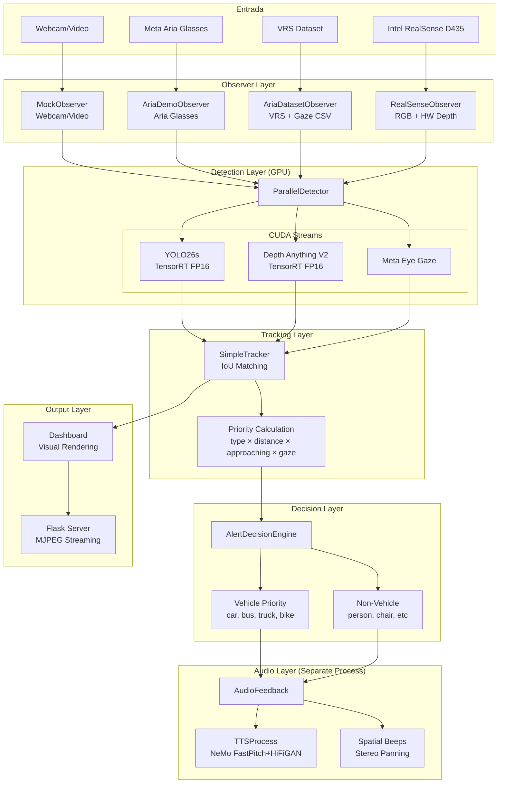

## Pipeline de Procesamiento

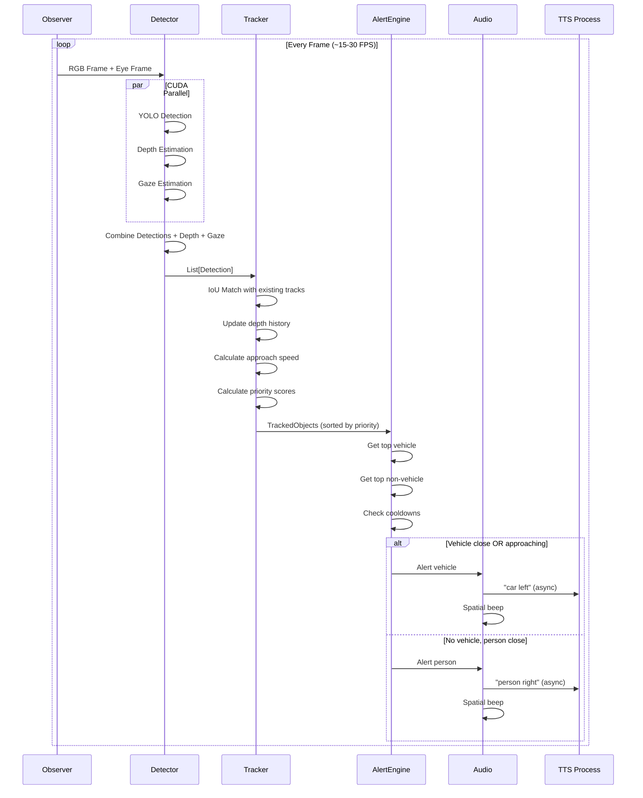

## Sistema de Tracking

### SimpleTracker

Tracking de objetos entre frames usando IoU (Intersection over Union):

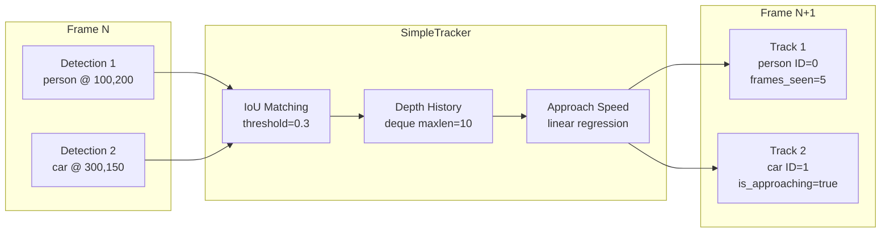

### TrackedObject

```python
@dataclass
class TrackedObject:
    id: int                    # Unique track ID
    name: str                  # Object class (person, car, etc)
    bbox: Tuple[int,int,int,int]  # x, y, w, h
    zone: str                  # left, center, right
    distance: str              # very_close, close, medium, far
    depth_value: float         # Normalized depth (0-1)
    confidence: float          # Detection confidence
    is_gazed: bool             # User looking at object?

    # Tracking state
    depth_history: deque       # Last 10 depth values
    frames_seen: int           # Consecutive frames tracked
    frames_missing: int        # Frames since last detection

    # Computed
    is_approaching: bool       # Depth increasing = approaching
    approach_speed: float      # Rate of approach
    priority: float            # Alert priority score
```

### Detección de Aproximación

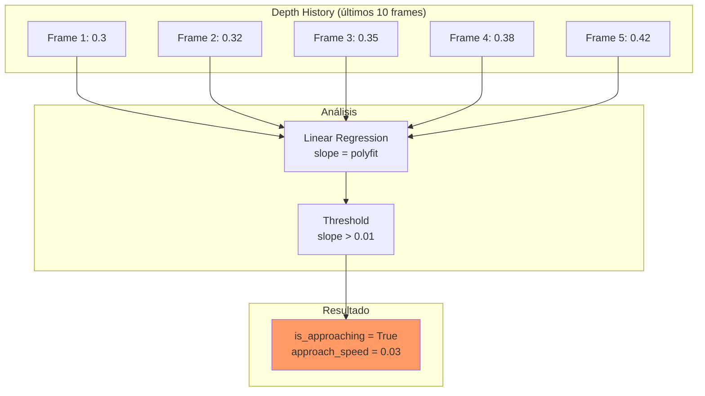

**Nota**: Depth Anything V2 usa profundidad inversa (mayor valor = más cerca). Si `depth_value` aumenta entre frames, el objeto se acerca.

### Cálculo de Prioridad

```python
priority = type_priority × distance_mult × approach_mult × gaze_mult
```

```mermaid
graph LR
    subgraph TypePriority["Tipo de Objeto"]
        CAR[car/truck/bus: 10]
        MOTO[motorcycle: 9]
        BIKE[bicycle: 8]
        PERSON[person: 6]
        DOG[dog: 5]
        CHAIR[chair: 3]
    end

    subgraph DistanceMult["Distancia ×"]
        VC[very_close: 4.0]
        CL[close: 2.0]
        MD[medium: 1.0]
        FR[far: 0.5]
    end

    subgraph ApproachMult["Aproximación ×"]
        YES[approaching: 2.0]
        NO[static: 1.0]
    end

    subgraph GazeMult["Gaze ×"]
        NL[not looking: 1.5]
        LK[looking: 1.0]
    end

    TypePriority --> DistanceMult
    DistanceMult --> ApproachMult
    ApproachMult --> GazeMult
```

**Ejemplo**: Coche acercándose, no visto:

```
10 (car) × 2.0 (close) × 2.0 (approaching) × 1.5 (not gazed) = 60
```

**Ejemplo**: Persona muy cerca, vista:

```
6 (person) × 4.0 (very_close) × 1.0 (static) × 1.0 (gazed) = 24
```

## Sistema de Decisión de Alertas

### AlertDecisionEngine

Centraliza toda la lógica de alertas:

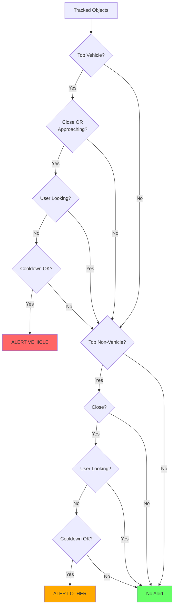

### Priorización Vehículo vs No-Vehículo

**Problema resuelto**: Un coche a distancia media era ignorado porque personas muy cercanas tenían más prioridad numérica.

**Solución**: Los vehículos tienen **prioridad absoluta** sobre no-vehículos:

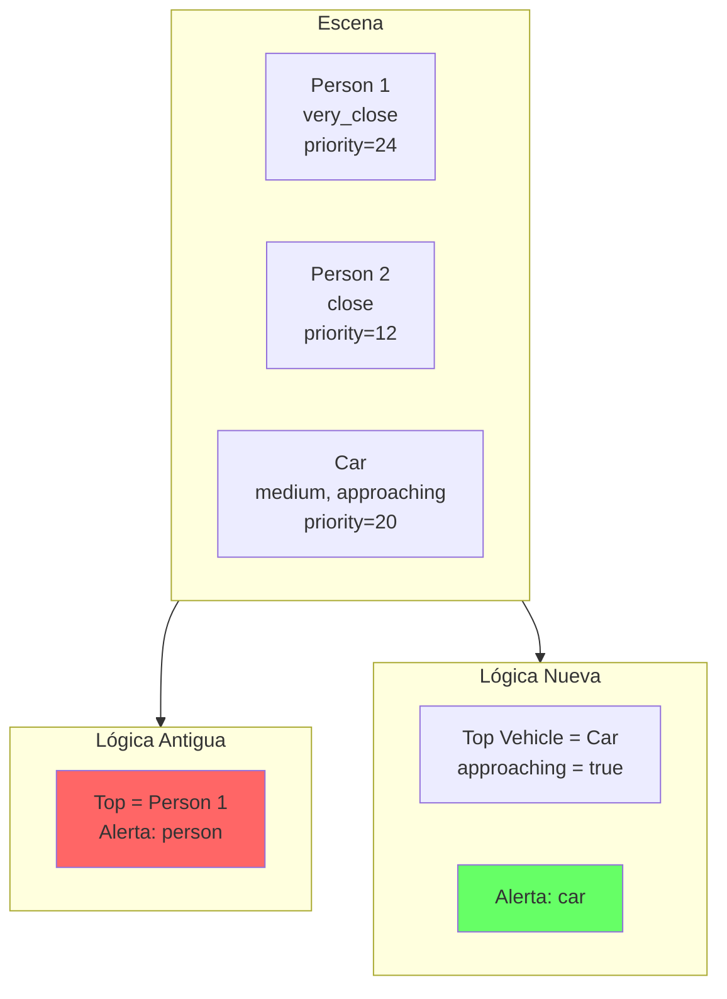

### Cooldowns

```python
vehicle_cooldown = 1.5s      # Entre alertas de vehículos
other_cooldown = 2.0s        # Entre alertas de no-vehículos
same_object_cooldown = 3.0s  # Antes de re-alertar mismo objeto
```

## Sistema de Audio

### Aislamiento CUDA: Process Isolation Pattern

**Problema**: Aria SDK (FastDDS) y CUDA (PyTorch/TensorRT) **no pueden coexistir** en el mismo proceso - causa "double free or corruption" y segfaults.

**Solución** (patrón de aria-nav): Ocultar CUDA del proceso principal y ejecutar modelos en procesos separados:

```
Main Process (NO CUDA)        DetectorProcess (spawn)       TTSProcess (spawn)
├─ Aria SDK (FastDDS)         ├─ YOLO TensorRT             ├─ NeMo TTS
├─ Flask server               ├─ Depth Anything V2         └─ Audio playback
├─ Dashboard rendering        └─ Eye Gaze model
└─ AudioFeedback wrapper
```

**Implementación**:

```python
# run.py - CRÍTICO: Ocultar CUDA ANTES de cualquier import
import os
os.environ["CUDA_VISIBLE_DEVICES"] = ""   # Ocultar GPU del proceso principal
os.environ["NUMBA_DISABLE_CUDA"] = "1"    # Desactivar numba CUDA

if __name__ == '__main__':
    import multiprocessing as mp  # NO torch.multiprocessing (importa torch)
    mp.set_start_method('spawn', force=True)

    # Ahora seguro importar módulos
    from src.web.main import app, process_loop
```

```python
# detector_process.py - Worker restaura CUDA
def _detector_worker(input_queue, output_queue, ...):
    import os
    os.environ["CUDA_VISIBLE_DEVICES"] = "0"  # Restaurar CUDA
    os.environ.pop("NUMBA_DISABLE_CUDA", None)

    # AHORA importar torch (con CUDA visible)
    from src.core.detector import ParallelDetector
    detector = ParallelDetector(...)
```

**Por qué funciona**:

- `spawn` crea procesos hijos desde cero (sin heredar estado)
- El proceso principal nunca inicializa CUDA (invisible)
- Cada worker restaura CUDA antes de importar torch
- Aria SDK y CUDA nunca se encuentran en el mismo proceso

**Patrón heredado de aria-nav** donde se descubrió este conflicto.

### Arquitectura Multi-Proceso (Aislamiento CUDA)

**Problema resuelto**: CUDA y Aria SDK (FastDDS) crasheaban con "double free or corruption".

**Solución**: Tres procesos separados con contextos CUDA aislados:

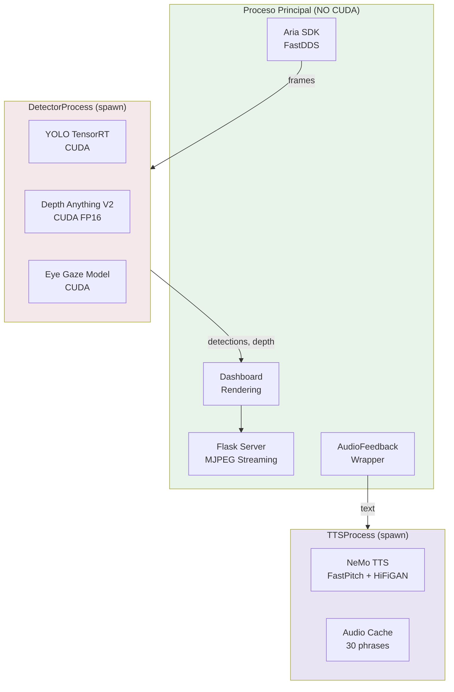

### Pre-caching de Frases

Para latencia mínima, las frases comunes se pre-generan al iniciar:

```python
PRECACHE_PHRASES = [
    "person left", "person right", "person straight",
    "car left", "car right", "car straight",
    "bicycle left", "bicycle right", "bicycle straight",
    "motorcycle left", "motorcycle right", "motorcycle straight",
    "bus left", "bus right", "bus straight",
    "truck left", "truck right", "truck straight",
    # ... 30 frases total
]
```

**Latencia**:

- Frase cacheada: **<10ms** (solo playback)
- Frase nueva: **~200ms** (generación + playback)

### Skip de Mensajes Antiguos

Si hay mensajes acumulados en la cola, solo se reproduce el **más reciente**:

```python
# En _tts_worker:
while not queue.empty():
    newer_msg = queue.get_nowait()
    msg = newer_msg  # Usar el más reciente
```

### Beeps Espaciales

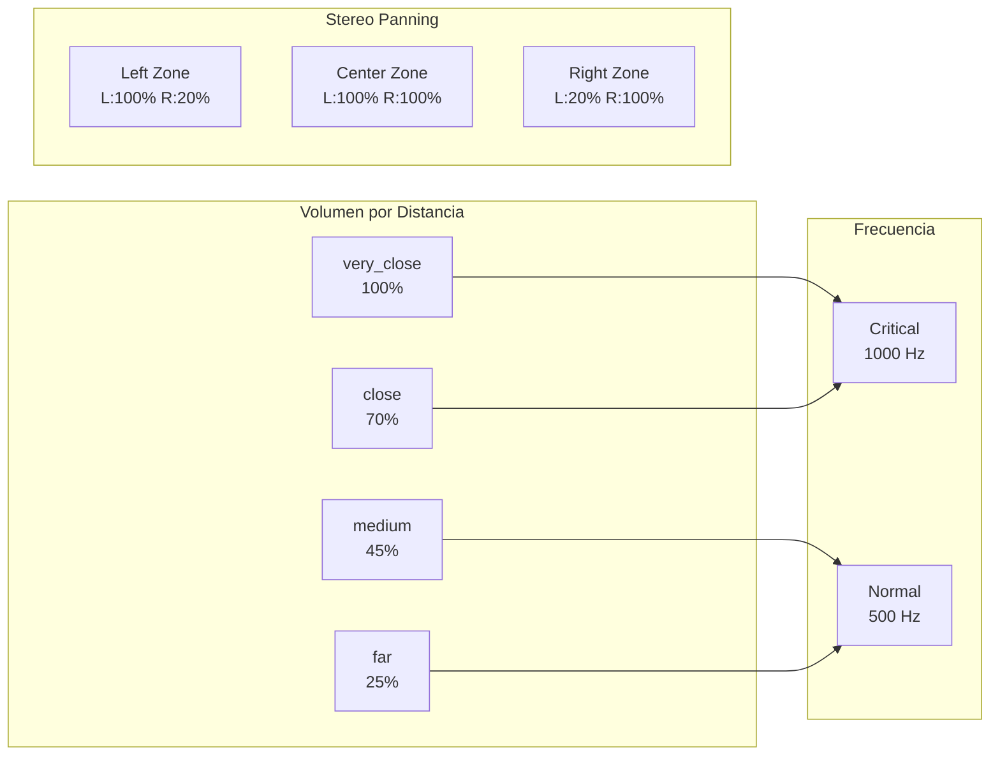

## Fuentes de Entrada

| Fuente | RGB | Depth | Gaze | Eye Tracking | Plataforma |
|--------|-----|-------|------|--------------|------------|
| Meta Aria Glasses | ✓ | IA (Depth Anything) | ✓ | ✓ | x86_64 |
| Intel RealSense D435 | ✓ | Hardware (instantáneo) | ✗ | ✗ | x86_64 + ARM64 |
| Webcam | ✓ | IA (Depth Anything) | ✗ | ✗ | Todas |
| Video/VRS | ✓ | IA (Depth Anything) | Precomputed | Precomputed | Todas |

**Ventajas RealSense D435:**
- Depth por hardware = ~0.8GB menos VRAM
- ~30% más rápido (sin modelo de depth IA)
- Funciona en Jetson Orin Nano (ARM64)

## Estructura del Proyecto

```
aria-guard/
├── run.py                      # Entry point
├── docker/
│   ├── Dockerfile              # Docker básico (desarrollo)
│   ├── Dockerfile.base         # OpenCV+CUDA+NVDEC (base image)
│   ├── Dockerfile.app          # App sobre base (builds rápidos)
│   ├── Dockerfile.tensorrt     # Todo-en-uno (legacy)
│   ├── Dockerfile.jetson       # Jetson Orin Nano + RealSense (ARM64)
│   ├── docker-build.sh         # Helper script (auto-detecta GPU)
│   ├── docker-compose.yml      # Compose x86_64
│   └── docker-compose.jetson.yml
├── tests/                      # Test scripts
├── src/
│   ├── core/
│   │   ├── __init__.py
│   │   ├── observer.py         # Frame capture (Aria/Webcam/VRS/RealSense)
│   │   ├── detector.py         # YOLO + Depth + Gaze (CUDA)
│   │   ├── detector_process.py # CUDA en proceso separado
│   │   ├── tracker.py          # SimpleTracker + TrackedObject
│   │   ├── alert_engine.py     # AlertDecisionEngine
│   │   ├── audio.py            # AudioFeedback + Beeps
│   │   ├── tts_process.py      # NeMo en proceso separado
│   │   └── dashboard.py        # Visual rendering
│   └── web/
│       ├── main.py             # Flask + MJPEG streaming
│       └── templates/
│           └── index.html
├── scripts/
│   └── export_depth_tensorrt.py  # Exportar Depth Anything a TensorRT
├── data/
│   └── aria_sample/            # VRS recordings + gaze CSV
├── models/                     # YOLO weights (.pt, .engine)
├── docs/
│   └── DOCKER.md               # Documentación Docker completa
└── requirements.txt
```

## Instalación via Docker (Recomendada)

> **📖 Documentación completa**: [docs/DOCKER.md](docs/DOCKER.md) - Arquitectura de imágenes, workflow de desarrollo, troubleshooting, diagramas detallados.

Esta es la **forma más segura** de ejecutar el proyecto, ya que aísla todas las dependencias y evita conflictos de librerías del sistema (como `glibc` vs Aria SDK).

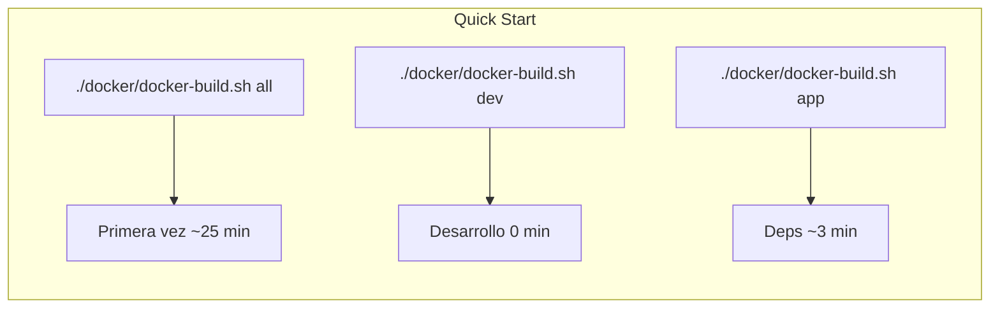

### Requisitos Previos

1. **Drivers NVIDIA** instalados en el sistema host.
2. **Docker Desktop** (Linux/Windows) o **Docker Engine**.
3. **NVIDIA Container Toolkit** (Crítico en Linux):
   ```bash
   sudo apt-get install -y nvidia-container-toolkit
   sudo nvidia-ctk runtime configure --runtime=docker
   sudo systemctl restart docker
   ```

### Ejecución Rápida

Clona el proyecto y simplemente ejecuta:

```bash
# Construye la imagen y levanta el contenedor con GPU
docker compose -f docker/docker-compose.yml up --build
```

El sistema descargará automáticamente la imagen base de Ubuntu 22.04, instalará las versiones correctas de Python, PyTorch y Aria SDK, compilará todo y lanzará la aplicación.

Si necesitas lanzar opciones personalizadas (como un video específico), entra en el contenedor:

```bash
docker exec -it aria-guard bash
# Dentro:
python run.py video.mp4
```

---

## Instalación Manual (Legacy)

```bash
cd aria-guard
python -m venv .venv
source .venv/bin/activate

# Dependencias base
pip install -r requirements.txt

# NeMo TTS (requiere CUDA)
pip install nemo_toolkit[tts]

# Meta Eye Gaze (opcional)
pip install projectaria-tools
pip install git+https://github.com/facebookresearch/projectaria_eyetracking.git

# Audio en Linux
sudo apt-get install -y libportaudio2 portaudio19-dev espeak-ng
```

## Uso

```bash
source .venv/bin/activate

# Desarrollo (sin gafas)
python run.py webcam           # Webcam (depth por IA)
python run.py video.mp4        # Video file
python run.py dataset          # VRS sample (data/aria_sample/)

# Intel RealSense D435 (RGB + depth por hardware)
python run.py realsense        # Depth instantáneo, sin modelo IA

# Gafas Aria reales (x86_64 only)
python run.py aria             # USB (por defecto)
python run.py aria:usb         # USB explícito
python run.py aria:wifi        # WiFi (IP por defecto: <ARIA_IP>)
python run.py aria:wifi:<ARIA_IP>  # WiFi con IP específica
```

Selecciona modo de detección:

- **[1] Indoor** - persona, silla, sofá, mesa, tv...
- **[2] Outdoor** - persona, coche, bici, moto, bus...
- **[3] All** - 80 clases COCO

Abre http://localhost:5000

## Conexión Meta Aria Glasses

### Requisitos

```bash
pip install projectaria-client-sdk projectaria-tools
```

### Streaming Profiles

| Interfaz | Profile   | FPS | Notas                       |
| -------- | --------- | --- | --------------------------- |
| USB      | profile28 | 30  | Recomendado, más estable    |
| WiFi     | profile18 | 30  | Requiere IP del dispositivo |

### Cámaras Disponibles

| Cámara            | Resolución | Stream         |
| ----------------- | ---------- | -------------- |
| RGB (centro)      | 1408×1408  | Siempre activo |
| Eye Track         | -          | Siempre activo |
| SLAM1 (izquierda) | 640×480    | Opcional       |
| SLAM2 (derecha)   | 640×480    | Opcional       |

### Troubleshooting

**"Connection refused"**: Verifica que Aria esté en modo streaming

```bash
# En el móvil: Aria App → Streaming → Start
```

**WiFi lento**: Usa USB si es posible, más estable y menor latencia

**"No se pudo obtener calibraciones"**: Normal si las gafas no están en modo correcto, continúa funcionando

## Rendimiento

### Metodología de Benchmark

Las mediciones se realizaron dentro del contenedor Docker de producción (`aria-guard:tensorrt`) para garantizar reproducibilidad. El procedimiento:

1. **Carga de frames**: 200 frames de video real (768x432, escena indoor) cargados en memoria RAM antes de medir, eliminando I/O del benchmark.
2. **Warmup**: 10 frames de calentamiento por componente para estabilizar caches de GPU, JIT de TensorRT y memory pools de CUDA.
3. **Medición individual**: Cada componente (YOLO, Depth, Gaze) se mide aislado con `torch.cuda.synchronize()` antes y después de cada frame para capturar la latencia real en GPU (no solo el tiempo de enqueue).
4. **Medición de pipeline**: El pipeline completo (`ParallelDetector`) ejecuta YOLO + Depth + Gaze en CUDA streams paralelos, midiendo el tiempo wall-clock incluyendo sincronización.
5. **Estadísticas**: Se reportan media, mediana, P95 y P99 sobre los 200 frames. Depth se ejecuta cada 3 frames (configurable) para balancear precisión y throughput.
6. **Comparativa de backends**: Cada modelo se mide con TensorRT FP16 (optimizado) y PyTorch/HuggingFace FP16 (baseline) para cuantificar el speedup de TensorRT.

El script de benchmark está en `experiments/benchmark_paper.py` y genera resultados en JSON (`experiments/benchmark_results.json`).

**Entorno**: NVIDIA GeForce RTX 2060 (6 GB VRAM), CUDA 12.8, TensorRT 10.8.0.43, PyTorch 2.10.0, OpenCV 4.13.0 (CUDA).

### Componentes Individuales

| Componente | Backend | FPS | Latencia media | Mediana | P95 |
|---|---|---:|---:|---:|---:|
| YOLO26s (9.5M params, 20.7 GFLOPs) | TensorRT FP16 | **188.2** | 5.31 ms | 4.90 ms | 8.17 ms |
| YOLO26s | PyTorch CUDA FP16 | 95.9 | 10.42 ms | 10.40 ms | 13.55 ms |
| Depth Anything V2-S (518x518) | TensorRT FP16 | **126.8** | 7.88 ms | 7.80 ms | 9.61 ms |
| Depth Anything V2-S | HuggingFace FP16 | 71.6 | 13.98 ms | 13.92 ms | 15.16 ms |
| Meta Eye Gaze (640x240) | PyTorch CUDA | **261.0** | 3.83 ms | 3.74 ms | 4.70 ms |

### Pipeline Completo

| Configuración | FPS | Latencia media | Mediana | P95 |
|---|---:|---:|---:|---:|
| YOLO + Depth + Gaze (todo TensorRT) | **66.7** | 14.99 ms | 10.01 ms | 26.32 ms |
| YOLO + Gaze sin Depth (TensorRT) | **108.2** | 9.24 ms | 9.27 ms | 10.36 ms |

> Depth se ejecuta cada 3 frames para mantener >60 FPS en el pipeline completo.

### Speedup TensorRT vs PyTorch

| Componente | Speedup |
|---|---:|
| YOLO26s | **1.96x** (188 vs 96 FPS) |
| Depth Anything V2-S | **1.77x** (127 vs 72 FPS) |

### Tamaños de Modelo

| Modelo | Formato | Tamaño |
|---|---|---:|
| YOLO26s | TensorRT FP16 (.engine) | 22.9 MB |
| YOLO26s | PyTorch (.pt) | 20.4 MB |
| Depth Anything V2-S | TensorRT FP16 (.engine) | 53.7 MB |
| Depth Anything V2-S | ONNX | 99.2 MB |

### Detección

- **YOLO26s** con threshold de confianza `conf=0.4` (reduce falsos positivos)
- Los engines de TensorRT son específicos por GPU y versión de TRT
- Si cambia la versión de TensorRT, regenerar: `python scripts/export_tensorrt.py`
- Benchmark reproducible: `python experiments/benchmark_paper.py`

### Optimizaciones

- **NVDEC** - Decodificación de video en GPU (OpenCV 4.13.0 + Video Codec SDK 13.0)
- **TensorRT FP16** para YOLO y Depth Anything V2
- **RealSense hardware depth** - Usa depth nativo (mm), sin modelo IA. Ver [docs/REALSENSE.md](docs/REALSENSE.md)
- **Shared memory IPC** - Zero-copy entre procesos (RGB + depth)
- **CUDA Streams** para ejecución paralela
- **NeMo en proceso separado** (evita conflictos CUDA)
- **Pre-caching TTS** para latencia mínima
- **GPU auto-detection** - `docker-build.sh` detecta compute capability y solo compila para la GPU local

### GPUs Soportadas

- RTX 20xx (Turing)
- RTX 30xx (Ampere)
- RTX 40xx (Ada Lovelace)
- **RTX 50xx (Blackwell)** - Requiere CUDA 12.8+ y Video Codec SDK 13.0

## VRAM Usage

Peak allocated: **1,236 MB** | Reserved: **449 MB**

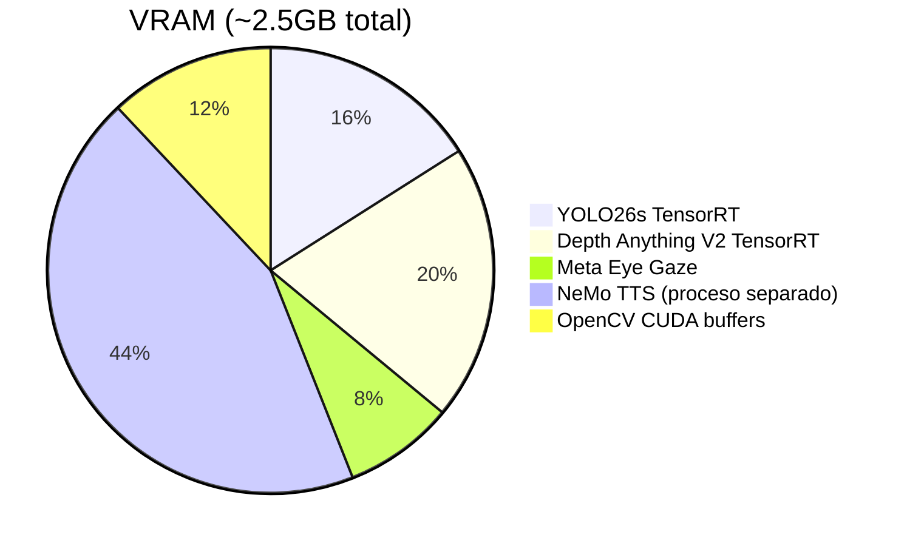

## Project Milestones

> Fuente de verdad: [Notion](https://notion.so) — estas tablas se sincronizan manualmente.

### Phase 1 — MVP ✅

| # | Milestone | Descripción |
|---|-----------|-------------|
| H1 | Project Setup + Docker | Dockerfile base CUDA, GPU auto-detect, multi-GPU (RTX 20xx/30xx/40xx/50xx) |
| H2 | YOLO TensorRT | YOLO26s FP16, 188 FPS, 5.3ms |
| H3 | Depth Estimation TRT | Depth Anything V2-S FP16, 127 FPS, 7.9ms (monocular, para Aria/webcam) |
| H4 | Object Tracking | SimpleTracker IoU matching entre frames |
| H5 | Alert System | AlertDecisionEngine, priorización por riesgo, anti-spam cooldowns, zone filtering |
| H6 | Spatial Audio | Beeps 3D estéreo, 4 zonas distancia (very_close/close/medium/far) + panning L/R |
| H7 | TTS (NeMo) | Proceso separado, aislamiento CUDA, cola de prioridad |
| H8 | Meta Aria Glasses | RGB + gaze-aware filtering (alerta solo objetos no vistos por el usuario) |
| H9 | Intel RealSense D435 | Hardware depth mm, align depth-to-color, distancias absolutas |
| H10 | Shared Memory IPC | Zero-copy RGB + depth entre procesos |
| H11 | NVDEC Video Decode | Hardware video decoding |
| H12 | Benchmarks Paper | benchmark_paper.py reproducible + results JSON (IWINAC 2026) |

### Phase 2 — Advanced Detection ⏳

| # | Milestone | Prioridad | Descripción |
|---|-----------|-----------|-------------|
| H13 | YOLO Fine-tune Navigation | ✅ Done | Clases custom: doors, stairs, curbs, traffic_light, signs |
| H14 | Traffic Light Classification | ✅ Done | HSV sobre crop YOLO: red/yellow/green, canal alerta independiente |
| H15 | Key Sign Detection | ✅ Done | Stop sign: alerta independiente con TTS. Yield/crosswalk requieren re-entrenamiento YOLO |
| H16 | Risk Prioritization v2 | ✅ Done | Approach continuo (1–3x), zone factor (center 1.5x), fast vehicle alert at far (speed>0.03) |
| H17 | ~~Haptic Feedback Prototype~~ | ⚪ Nice to have | Vibración via BLE/serial — requiere hardware custom, bajo ROI vs audio |

> **Nota:** Una vez completada Phase 2 en Python, todo se porta a aria-core (C++) como parte de H22 (Obstacle Avoidance).

### Phase 3 — Threat Model & Audio (basado en papers) ⏳

Rediseño del sistema de alertas basado en evidencia académica (ver [docs/RESEARCH.md](docs/RESEARCH.md)).

| # | Milestone | Prioridad | Descripción |
|---|-----------|-----------|-------------|
| H18 | Collision Risk Score | ✅ | `collision_risk()` 0.0–1.0: TTC (50%) + CBDR bearing (25%) + zone (15%) + class (10%). 4 factores ADAS |
| H19 | Alert Arbiter (2 canales) | ✅ | Canal A: top-1 por risk (DANGER/WARNING/ATTENTION). Canal B: contexto. Rate limit 6/30s, anti-saturación |
| H20 | Audio BRR + Pitch | ✅ | BRR burst 3/2/1 beeps. Pitch 400–1100Hz por distancia. TTS "danger left". Pan mejorado |
| H21 | Benchmark Offline | 🔴 Alta | Script que procesa Tokyo_POV.mp4 sin audio: mide alerts/min, silent ratio, false alerts. Target: >80% silencio, 0 alertas simultáneas |

> **Principio (Gao 2025, Nature):** Al usuario no le importa si es coche o bus. Le importa cuánto peligro hay y de dónde viene.

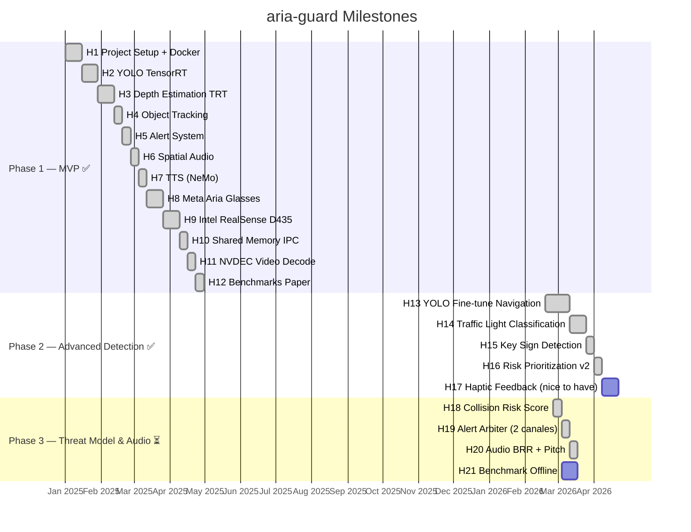

## Créditos

- [Ultralytics YOLO](https://github.com/ultralytics/ultralytics)
- [Depth Anything V2](https://github.com/DepthAnything/Depth-Anything-V2)
- [NVIDIA NeMo](https://github.com/NVIDIA/NeMo)
- [Meta Project Aria](https://www.projectaria.com/)
- [projectaria_eyetracking](https://github.com/facebookresearch/projectaria_eyetracking)
