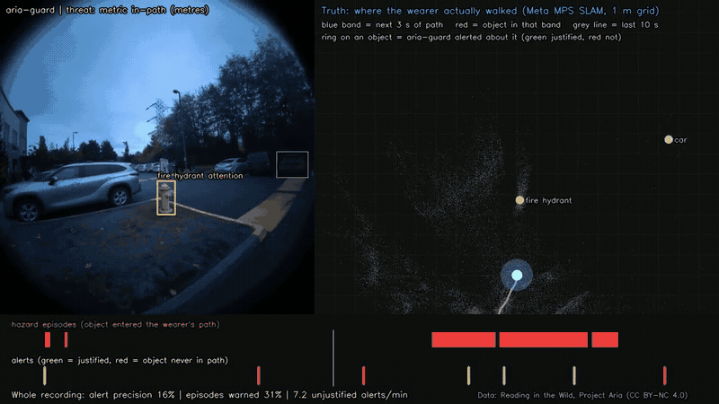
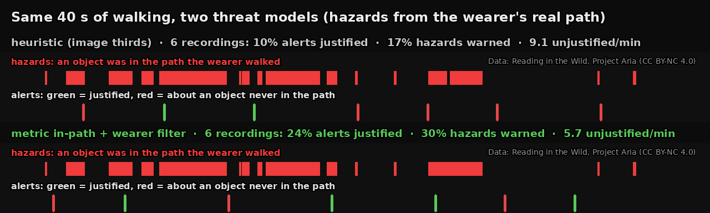

# aria-guard

Real-time collision alerts for blind and low-vision pedestrians, running on
Meta Project Aria glasses: a navigation detector, monocular depth and eye gaze
feed a tracker that decides when to warn, with spatial audio.



*Left: what aria-guard sees and says. Right: the ground truth, where the wearer
actually walked (Meta MPS SLAM, metres). A green ring is an alert about an
object that was in that path; a red ring is an alert about one that never was.*

> **Status: research prototype, evaluated offline.** Measured on six outdoor
> walking recordings from Project Aria's *Reading in the Wild* dataset. Not
> tested with blind users, not a medical device. A live session with the
> glasses is the next validation step.

## Results at a glance

| Question | Answer (six recordings, 36.9 min) |
|---|---|
| Does it run in real time on a desktop GPU? | Yes: 30 FPS on 6 of 6 recordings on an RTX 5060 Ti, capture → detections p50 20.9 ms |
| On a Jetson Orin Nano? | Partly: 24.5 FPS after optimization (13 before), but capture → detections p95 is 136 ms against a 100 ms target set beforehand; CPU JPEG decoding (39 ms) is the bottleneck |
| Are the alerts about obstacles in the wearer's path? | Mostly not with the original logic (**15 %** precision); **38 %** with the metric in-path model adopted here |
| Does it warn when an obstacle is in the path? | For **33 %** of hazard episodes (was 16 %), often late: median lead time 1–3 s |



## How it is evaluated

Nothing is labelled by hand. Two measurements, both reproducible from scripts
and JSON records in this repository:

1. **Replay benchmark** ([docs/REPLAY_BENCHMARK.md](docs/REPLAY_BENCHMARK.md)).
   Aria VRS recordings go through the real pipeline: RGB and eye images with
   the live orientation, the IMU, the detector, the tracker and the alert
   arbiter. Frames are decoded on their own thread at capture time and dropped
   when the pipeline falls behind, as they are live. One JSON per run records
   the environment, commit and model hash.
2. **Alert evaluation against the wearer's real path**
   ([docs/ALERT_EVALUATION.md](docs/ALERT_EVALUATION.md)). Meta's MPS output
   gives the glasses' metric trajectory and a 3D point cloud. Each detection gets
   a ground position in metres; a *hazard episode* is an object inside the path
   actually walked over the next 3 s. Definitions, thresholds and decision rules
   were committed **before** computing results, and every later change is a
   dated amendment.

The geometry was checked by projecting the SLAM point cloud onto the camera
images: points land on car outlines, curbs and a fire hydrant.

### What the evaluation changed

- **The alert logic, not the detector, was the weak point.** It decided "in
  front of me" from image thirds and a relative depth renormalized every frame.
  Even with a 5 m corridor only ~35 % of its alerts concerned objects near the
  path.
- **Metric in-path threat, adopted.** The bbox bottom ray, gravity from the
  accelerometer and a fixed 1.6 m eye height give each object's forward and
  lateral distance in metres. Precision rose from 14.6 % to 37.6 %, episode
  recall from 15.7 % to 33.1 %, and unjustified alerts per minute fell from 8.6
  to 5.4, better on 6 of 6 recordings.
- **Time-to-collision was inverted.** It divided proximity by speed as if it
  were distance. The fix is correct but did not change alert quality measurably.
- **Recorded playback was upside down.** It rotated frames the opposite way to
  live streaming; both paths now share one transform.
- **Known limits, stated in the evaluation doc.** The reference and the model
  both use the bbox bottom, so independence is partial. Distances come out
  shorter than the reference (eye height differs per wearer). DANGER dominates
  the adopted model's alerts.

## Performance

Generated by `scripts/replay_table.py` from `benchmarks/replay/*.json`.

<!-- replay-table:start -->
### Realtime replay

| Device | Build | Model | Recordings | Effective FPS (median / worst) | Frames dropped | Capture → detections p50 / p95 (ms) | Alerts/min (median / max) | All alert criteria pass |
|---|---|---|---|---|---|---|---|---|
| NVIDIA GeForce RTX 5060 Ti · TensorRT 10.16.1.11 | 3992e54 · YOLO ultralytics · sync depth | yolo26n_nav | 6 | 30.0 / 30.0 | 0.0 % | 20.9 / 31.6 | 9.4 / 10.8 | 6/6 |
| Orin · TensorRT 10.3.0 | 3992e54 · YOLO ultralytics · sync depth | yolo26n_nav | 6 | 13.0 / 12.7 | 56.4 % | 146.3 / 255.4 | 9.4 / 11.0 | 6/6 |
| Orin · TensorRT 10.3.0 | 773faeb · YOLO tensorrt · async depth | yolo26n_nav | 6 | 19.0 / 18.8 | 36.0 % | 133.0 / 176.7 | 9.9 / 10.8 | 6/6 |
| Orin · TensorRT 10.3.0 | 773faeb · YOLO tensorrt · sync depth | yolo26n_nav | 6 | 16.2 / 15.9 | 45.8 % | 133.7 / 211.7 | 9.8 / 11.2 | 6/6 |
| Orin · TensorRT 10.3.0 | 84902f6 · YOLO tensorrt · async depth | yolo26n_nav | 6 | 24.5 / 24.2 | 17.5 % | 101.8 / 136.4 | 9.7 / 11.2 | 6/6 |

### Per-stage cost (every frame, GPU synchronized per stage)

| Stage (ms, median of per-recording p50 / p95) | NVIDIA GeForce RTX 5060 Ti · TensorRT 10.16.1.11 · 3992e54 · YOLO ultralytics · sync depth | Orin · TensorRT 10.3.0 · 3992e54 · YOLO ultralytics · sync depth | Orin · TensorRT 10.3.0 · 773faeb · YOLO tensorrt · sync depth | Orin · TensorRT 10.3.0 · 84902f6 · YOLO tensorrt · sync depth |
|---|---|---|---|---|
| VRS decode | 16.23 / 17.29 | 39.07 / 44.65 | 39.25 / 47.42 | 39.26 / 48.73 |
| YOLO | 3.08 / 3.26 | 24.14 / 24.84 | 22.36 / 23.20 | 18.36 / 18.80 |
| Depth (1 in 5 frames) | 9.82 / 10.18 | 77.09 / 82.93 | 64.97 / 70.03 | 62.49 / 68.19 |
| Gaze (1 in 2 frames) | 0.77 / 0.83 | 5.54 / 5.96 | 5.35 / 5.81 | 5.33 / 5.74 |
| Detections + depth lookup | 0.32 / 0.62 | 1.31 / 2.53 | 0.37 / 0.62 | 0.36 / 0.61 |
| Tracker + arbiter | 0.29 / 0.60 | 0.89 / 1.94 | 0.88 / 1.95 | 0.88 / 1.95 |
| Detector total | 4.16 / 14.23 | 30.56 / 109.11 | 28.73 / 93.67 | 24.72 / 88.61 |
<!-- replay-table:end -->

On the Jetson, three changes account for 13 → 24.5 FPS: calling the YOLO
TensorRT engine directly with GPU preprocessing, running depth asynchronously,
and restoring OpenCV's thread count, which `import ultralytics` silently sets
to one. The 100 ms p95 target is still missed. What remains is CPU JPEG decoding
(39 ms per frame) and GPU frequency scaling: the YOLO engine takes 6.7 ms in a
continuous loop but 11.3 ms with 40 ms pauses between frames.

## Architecture

```
Main process (no CUDA)                       DetectorProcess (CUDA)
├─ Observer: Aria live / VRS / RealSense     ├─ yolo26n_nav, TensorRT FP16 (engine called directly)
├─ MetricInPath: ground contact + gravity    ├─ Depth Anything V2 Small, TensorRT FP16 (every 5th frame)
├─ SimpleTracker + AlertArbiter              └─ Meta eye gaze, TensorRT FP16 (every 2nd frame)
├─ AudioFeedback (spatial beeps + TTS)
└─ Flask dashboard :5000
```

| Component | Role |
|---|---|
| `src/detection/detector.py` | YOLO, depth and gaze in parallel CUDA streams |
| `src/input/metric_inpath.py` | Forward / lateral metres of each detection from calibration and IMU |
| `src/domain/tracker.py` | IoU tracking; threat level from the metric model, heuristic fallback |
| `src/domain/alert_engine.py` | Two channels (threat, context), cooldowns, rate limit |
| `src/input/aria_frames.py` | Frame orientation, gravity and motion state shared by live and replay |

The detector is `yolo26n_nav`, a 24-class navigation model trained and
benchmarked in [vision-fine-tuning](https://github.com/robertteleng/vision-fine-tuning).

## Quick start

```bash
uv sync --extra dev
./run.sh aria:usb                    # Aria glasses over USB
./run.sh aria:wifi:<glasses-ip>      # Aria over WiFi (or set ARIA_IP)
./run.sh data/video.mp4 outdoor      # a video file
```

Open http://localhost:5000 for the dashboard. `ARIA_THREAT_MODEL=heuristic`
restores the previous threat logic.

### Models

Engines are not portable: build them on the device that runs them.

```bash
# navigation detector from vision-fine-tuning, exported with Ultralytics on this device
cp <vision-fine-tuning>/models/yolo26n_nav.pt models/
uv run yolo export model=models/yolo26n_nav.pt format=engine half=True imgsz=640

python scripts/export_depth_tensorrt.py                 # Depth Anything V2 Small -> ONNX -> engine
python scripts/download_gaze_weights.py
python scripts/export_gaze_onnx.py models/gaze.onnx
python scripts/build_trt_engine.py models/gaze.onnx models/gaze.engine
```

## Reproduce the measurements

```bash
# replay benchmark: every recording, realtime and per-stage
PYTHON="uv run python" ./scripts/replay_benchmark.sh ~/Datasets/aria/ritw benchmarks/replay
python scripts/replay_table.py benchmarks/replay/*.json

# alert evaluation against MPS (needs the recordings' mps/ folder)
python scripts/evaluate_alerts.py --variants ttc_fix metric_inpath \
    --detections benchmarks/replay/detections/<run>.json \
    --recording ~/Datasets/aria/ritw/<recording> --out benchmarks/alerts/<run>.json
python scripts/alert_table.py benchmarks/alerts/candidate1/*.json --variants ttc_fix metric_inpath
```

Tests: `uv run pytest` (198 tests, no hardware needed; GPU tests skip).

## Related

- [vision-fine-tuning](https://github.com/robertteleng/vision-fine-tuning): the navigation detector, its dataset and edge benchmarks
- [aria-arm64-bridge](https://github.com/robertteleng/aria-arm64-bridge): Aria streaming on the Jetson before native ARM64 SDK wheels

## License

Code: [AGPL-3.0](LICENSE) (it links Ultralytics YOLO). Third-party models and
runtimes: [THIRD_PARTY.md](THIRD_PARTY.md). Media in `docs/media/` contains
frames from *Reading in the Wild* (CC BY-NC 4.0) and is not covered by the AGPL.
